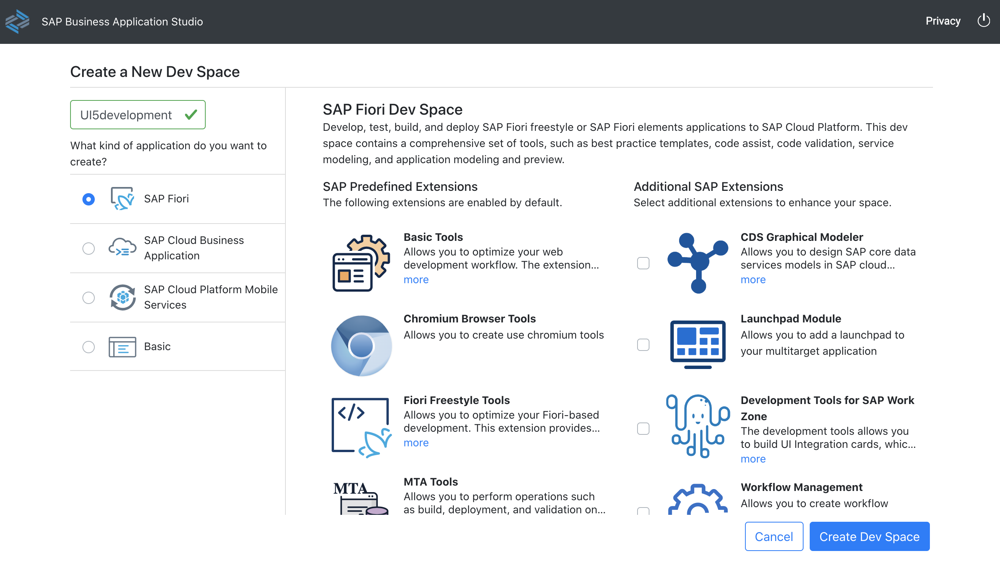
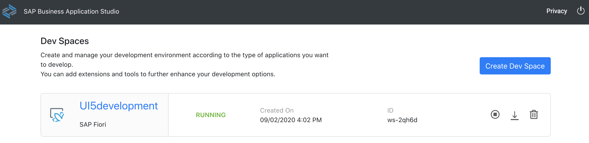
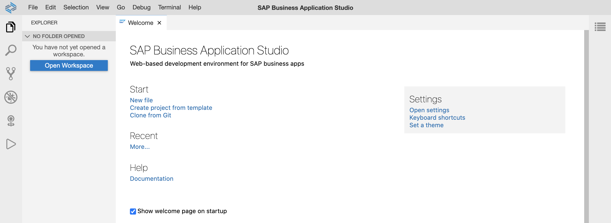

# Getting Started

In this exercise, you will logon to your SAP Business Application Studio, create a dev space and get a brief overview.

## Logon
After completing these steps you will know how to open your SAP Business Application Studio.

1. Open a browser of your choice (Google Chrome, Microsoft Edge, Apple Safari, etc.).

2. Open [SAP Business Application Studio](https://triallink.eu10.trial.applicationstudio.cloud.sap/) and login with your credentials. If the login does not work, ensure you have completed the [requirements](../../README.md#requirements). 

3. Now, you have to create a dev space. Therefore, click on *Create Dev Space* button. 
 

4. Enter a name of your your dev space, e.g. *UI5development*, select application type *SAP Fiori* and click on *Create Dev Space* button.
 

5. Now, your dev space is prepared and starts. The starting process might take some minutes. Wait until the status shows *RUNNING*.
 

6. Click on the dev space name e.g. *UI5development*. You'll be redirected to your newly created SAP Business Application Studio dev space.
 

7. Bookmark this url, so its easier for you to access this dev space of your SAP Business Application Studio.

## Summary

Congratulations, you achieved the [Getting Started](#getting-started) exercise.

Continue to - [Exercise 1 - Project Setup using Business Application Studio](../ex1/README.md)
