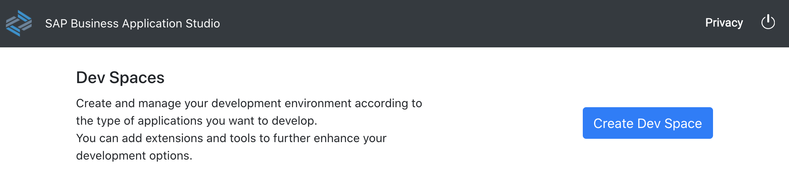
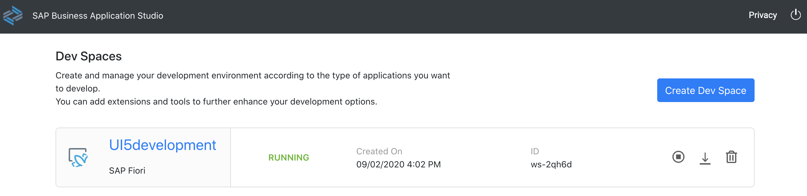
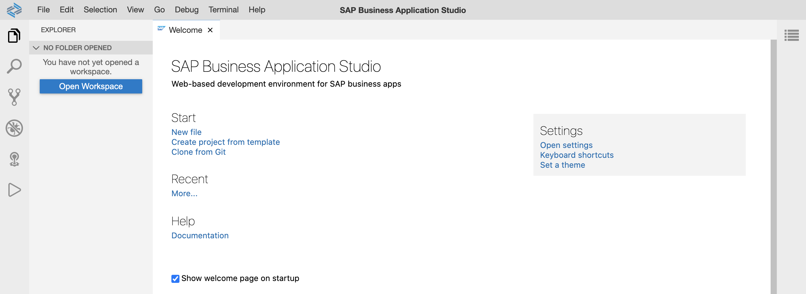

# Getting Started

In this exercise, you will logon to your SAP Business Application Studio account, create a dev space, and get a brief overview.

## Logon

After completing these steps you will know how to open SAP Business Application Studio and prepare it for development.

1. Open a browser of your choice (Google Chrome, Microsoft Edge, Apple Safari, etc).

2. Open SAP Business Application Studio [Academy for Engineering Account](https://mde2103.us10cf.applicationstudio.cloud.sap/index.html) or [Trial Version](https://triallink.eu10.trial.applicationstudio.cloud.sap/) and login with your credentials. If the login doesn't work, make sure you fulfill the [requirements](../../README.md#requirements). 

3. Now you can create your dev space! Click *Create Dev Space*.
    

4. Enter the new name of your dev space, e.g. *UI5development*, select *SAP Fiori* as application type, and click *Create Dev Space*.
    

5. Your dev space is being prepared and starts up. This might take a few minutes. Wait until the status shows *RUNNING*.
    

6. Click on your dev space name, e.g. *UI5development*. You'll be redirected to your newly created SAP Business Application Studio dev space.
    

7. Bookmark this URL, so it'll be easier for you to access your dev space within SAP Business Application Studio.

## Summary

Congratulations, you completed the [Getting Started](#getting-started) exercise!

Continue to [Exercise 1 - Project Setup Using Business Application Studio](../ex1/README.md).
