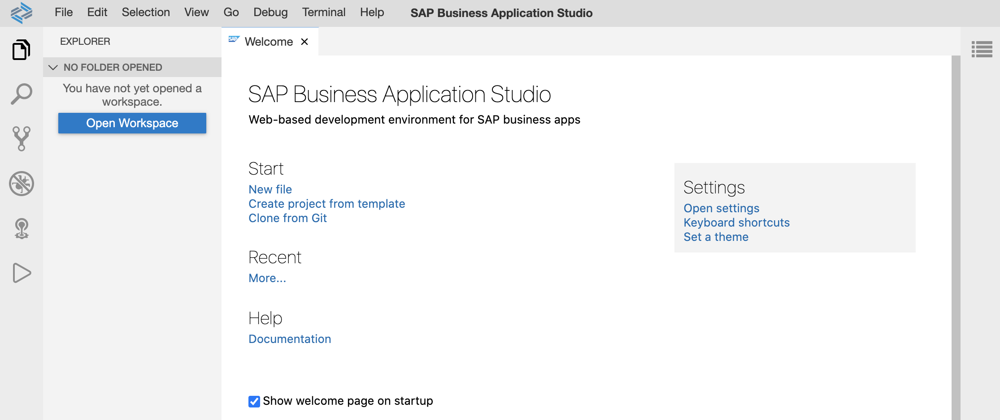
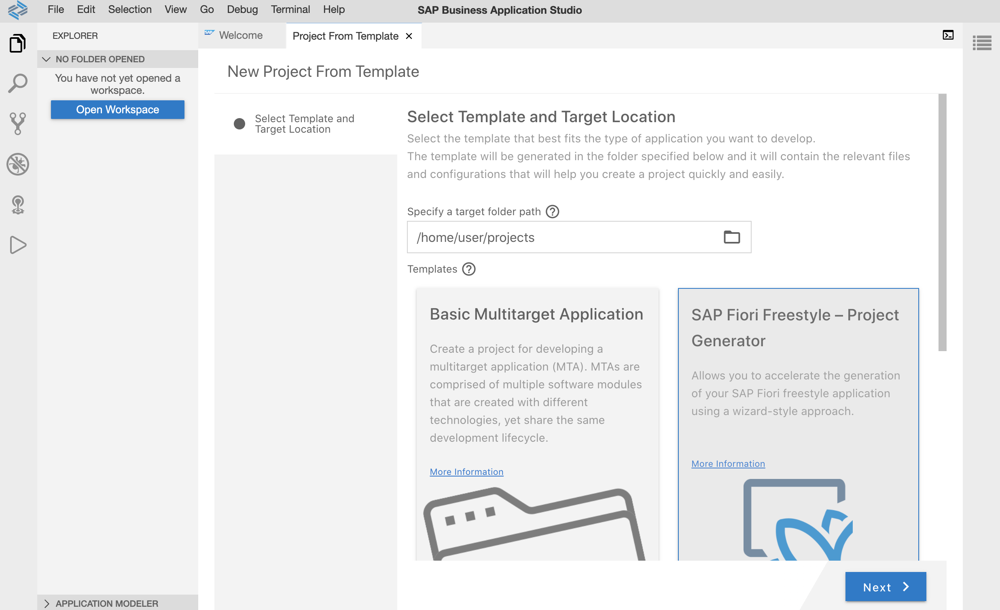
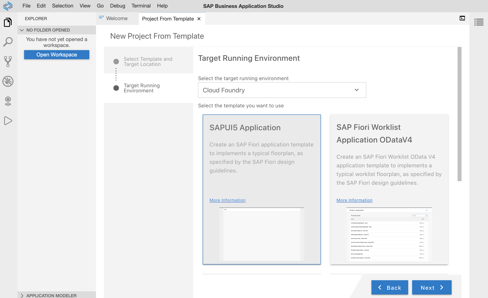
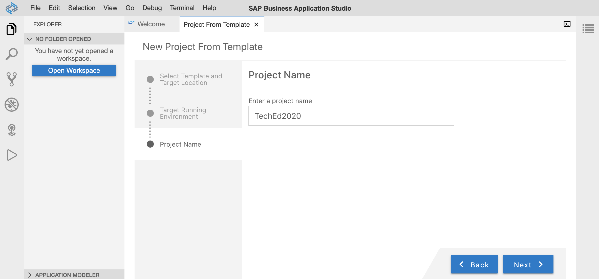
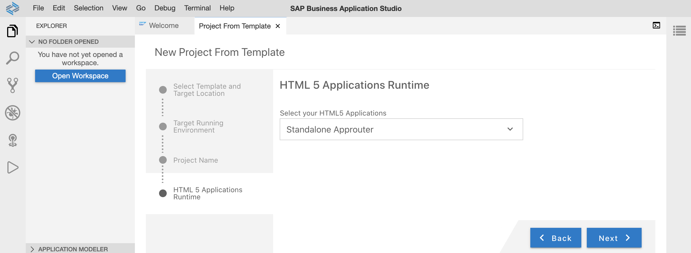
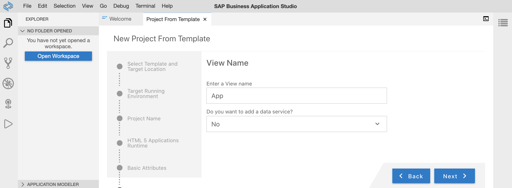
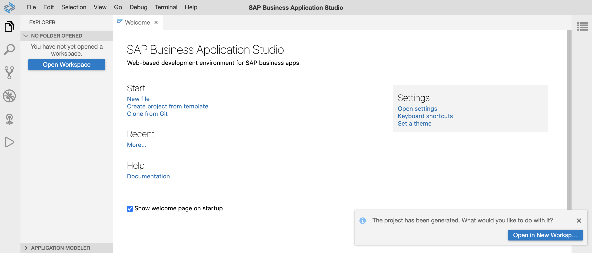
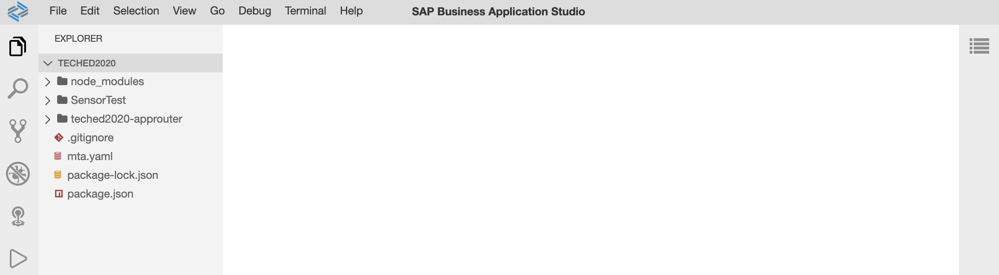

# Exercise 1 - Project Setup using SAP Business Application Studio

In this exercise, you will create a new UI5 application based on a provided template of SAP Business Application Studio.

## Scenario
Your customer "Keep Cool Inc." is a maintainer of several icehouses across the country. Recently those have been upgraded with new sensors with internet connection, so that their measuring values are available as a service. To make use of this data and to improve their internal workflows the company asked us to provide an application leveraging this sensor data, visualize it and provide an overview of the current state of each sensor, so that they can react quickly on any issues.

## Exercise 1.1 Create a new UI5 application

After completing these steps you will have created your first UI5 application.

1. Click on *Create project from template* on the *Welcome* page.
    * [Optional] If you have closed the *Welcome* page accidentally, click in the header toolbar on *View* and then select *Find Command...*. A new popup is opend, enter here *SAP Business Application Studio: Welcome Page*.</ul>
 

2. Choose *SAP Fiori Freestyle - Project Generator* and press *Next*
 

3. Enter following settings in the *Target Running Environment* step: 
    1. Select *Cloud Foundry* as *target running environment*
    2. Select *SAPUI5 Application* as application template and press *Next*.

4. Enter *TechEd2020* as project name and press *Next*.
 

5. Choose the *Standalone Approuter* as your *HTML 5 Applications Runtime* and press *Next*.
 

6. Enter following settings in the *Basic Attributes* step:
    1. Enter *SensorsTest* as *HTML5 module name* 
    2. Choose *No* as authentication
    3. Enter *keepcool* as your namespace
    4. Choose *Yes* for karma support and press *Next*.

7. Enter *App* as your view name, choose *No* for data service usage and press *Next*.
 

8. The project is generated and a small notification window appears in the lower right corner. Click on *Open in New Workspace*.
 

9. Now, the project should be visible in the File Explorer.
 

## Summary
Hooray! You've successfully accomplished [Exercise 1 - Project Setup using SAP Business Application Studio](#exercise-1-project-setup-using-sap-business-applicationsstudio).

Continue to - [Exercise 2 - Navigation and Libraries in Manifest](../ex2/README.md)

