

# Exercise 1 - Project Setup Using SAP Business Application Studio

In this exercise you'll create a new UI5 application based on a template provided by SAP Business Application Studio.

## Scenario

Your customer "Keep Cool, Inc." is an operator of several icehouses across the country. Recently, they have been upgraded with new sensors with Internet connection, so that their measuring values are available as a service. To make use of this data and improve their internal workflows, the company asked us to provide an application leveraging this sensor data, visualize it, and provide an overview of the current state of each sensor, so that they can react quickly on any issues.

## Exercise 1.1 - Create a New UI5 Application

After completing these steps you'll have created your first UI5 application.

1. Click on *Create project from template* on the *Welcome* page.
    * [Optional] If you have closed the *Welcome* page accidentally, click in the header toolbar on *View*, and select *Find Command...*  Enter *SAP Business Application Studio: Welcome Page*.</ul>
  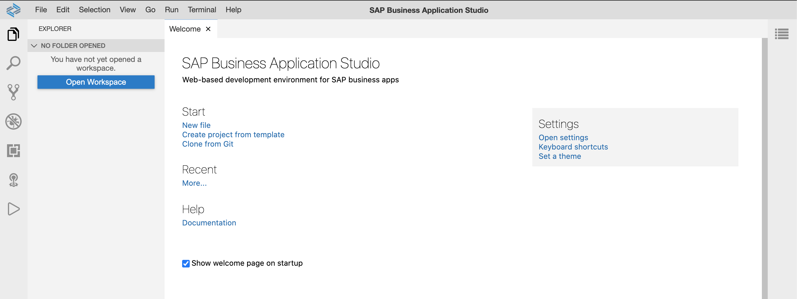  

2. Choose *SAP Fiori Freestyle Project* and click *Next*.
    

3. Enter the following settings in the *Target Running Environment* step: 
    1. Select *Cloud Foundry* as target running environment.
    2. Select *SAPUI5 Application* as application template and click *Next*.</ol>
   <ol>

4. Enter *TechEd2020* as project name and click *Next*.
  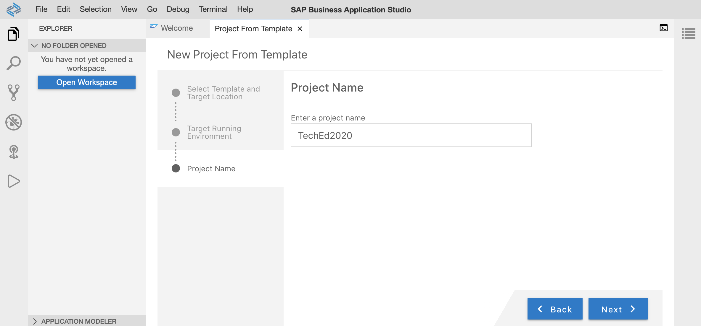  

5. Choose the *Standalone Approuter* as your *HTML 5 Applications Runtime* and click *Next*.
  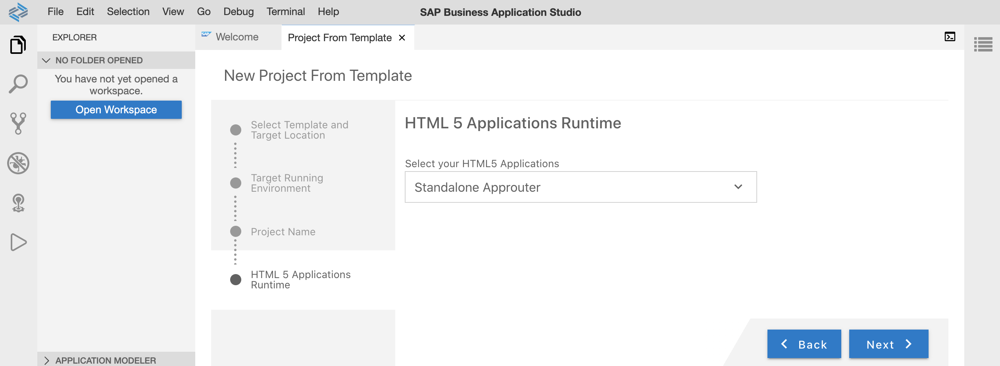  

6. Enter the following settings in the *Basic Attributes* step:
    1. Enter *SensorManager* as *HTML5 module name*. 
    2. Choose *No* for authentication usage.
    3. Enter *keepcool* as your namespace.
    4. Choose *Yes* for Karma support and press *Next*.</ol>
 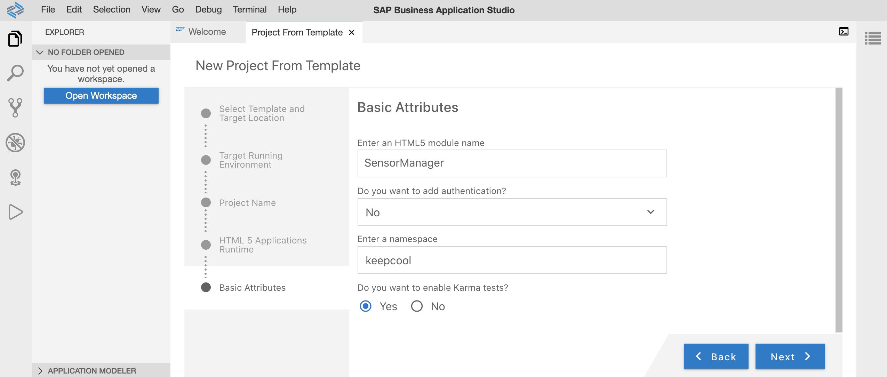  <ol>

7. Enter *App* as your view name, choose *No* for data service usage, and press *Next*.
  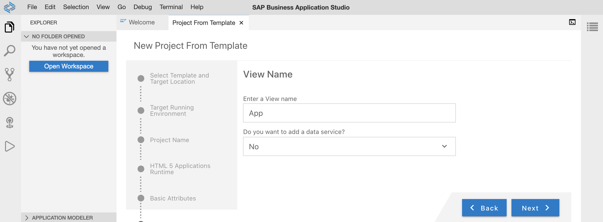  

8. The project is generated, and a notification window appears in the lower right corner. Click *Open in New Workspace*.
   * [Optional] If you have closed the notification window accidentally, click *File* in the header toolbar, select *Open Workspace* and pick the generated project.  </ul>
    

9. The newly created UI5 application is displayed in the File Explorer.
    

## Exercise 1.2 - Create a Run Configuration

It's time for a first preview of your newly created application!

1. Click the &#9654; icon in the left icon bar.
  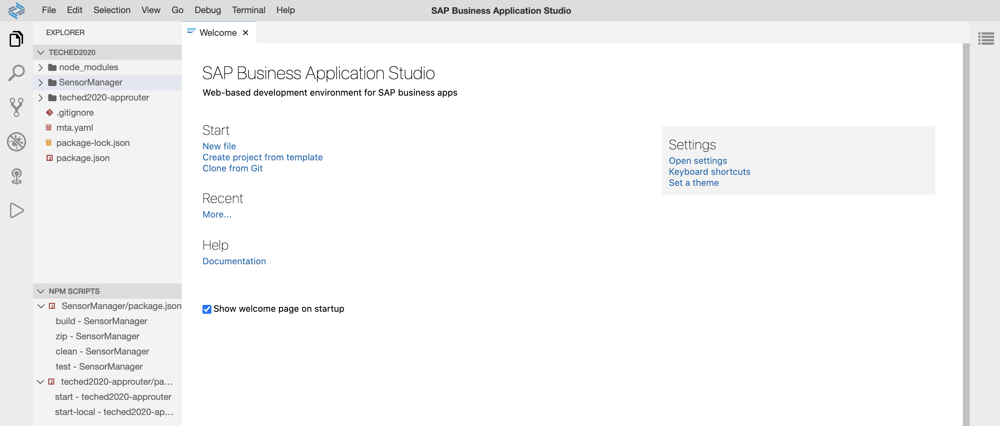  

2. Click the &plusb; icon to add a new configuration to *Run Configurations*. After a short delay, a list pops up in the top center of your screen. 
  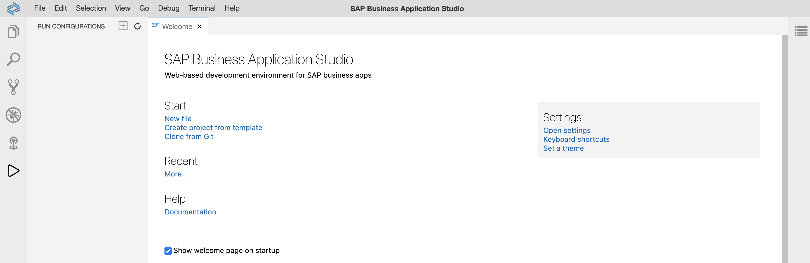  

3. Select the module *SensorManager* that you've just created.
  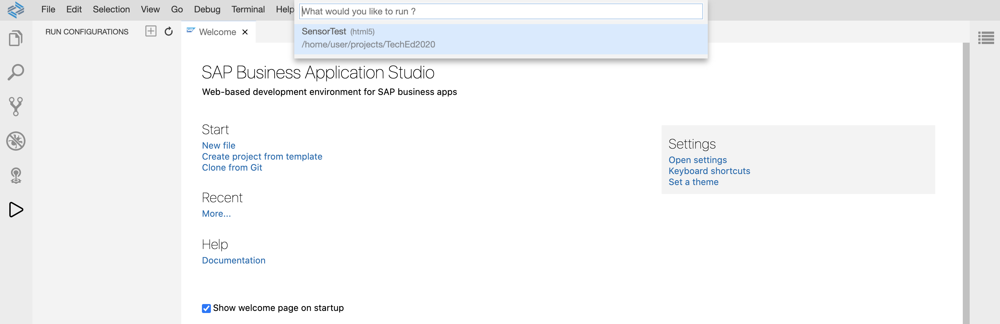  

4. Specify your desired html site. Select *index.html* as the runnable file.
  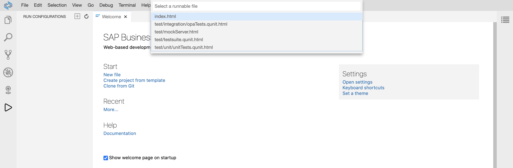  

5. Select *latest* as your UI5 version.
  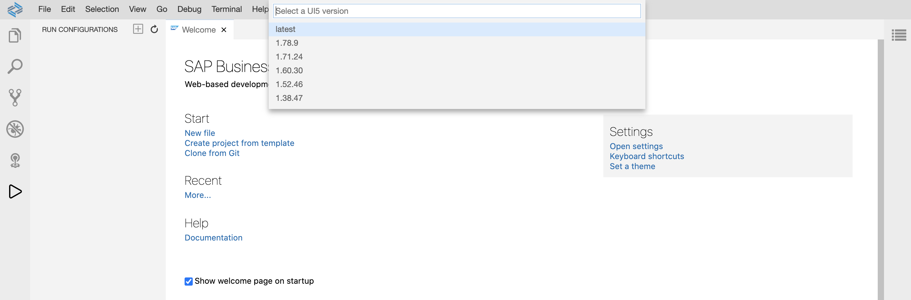  

6. Enter *Run TechEd2020-SensorManager* as the name of your new run configuration.
  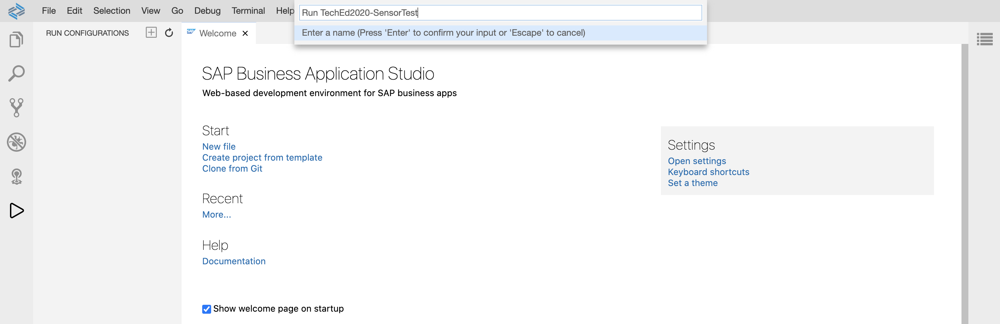  

7. A new configuration *Run TechEd2020-SensorManager* should appear on the left. Select the new configuration and click the green icon *Run Module*.
  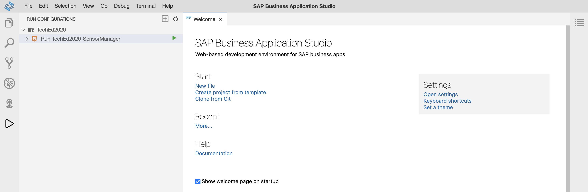  

8. The application is initialized. After a few seconds, some notifications are displayed in the lower right corner. Click *Expose and Open*.
  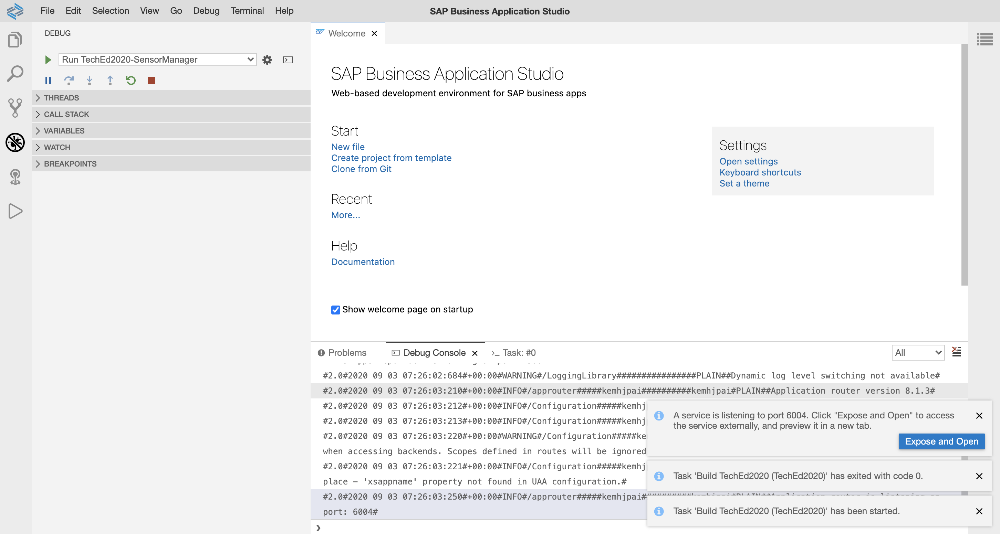  

9. After a short delay, a popup for some optional input opens. Leave it empty and press *Enter*.
    * [Optional] If you have closed the tab with the application preview accidentally, click *View* in the header toolbar, select *Find Command...*, enter: "Ports: Preview" and select your active port. A new tab with the application preview opens.
  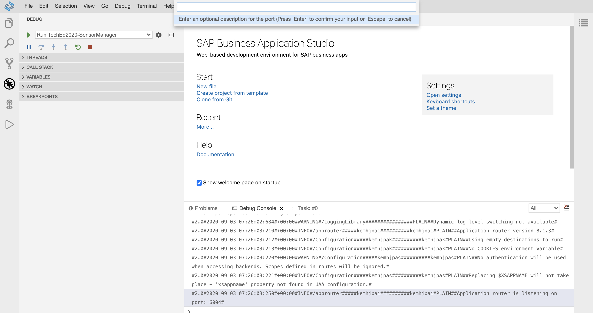  

10.  The UI5 application is opened in a new tab.
  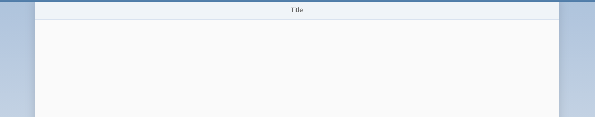  

## Summary

Hooray! You've successfully accomplished [Exercise 1 - Project Setup using SAP Business Application Studio](#exercise-1---project-setup-using-sap-business-applicationsstudio)!

Continue to [Exercise 2 - Basic UI5 Configuration and  View Creation](../ex2/README.md).
