

# Exercise 1 - Project Setup Using SAP Business Application Studio

In this exercise you'll create a new UI5 application based on a template provided by SAP Business Application Studio.

## Scenario

Your customer "Keep Cool, Inc." is an operator of several icehouses across the country. Recently, they have been upgraded with new sensors with Internet connection, so that their measuring values are available as a service. To make use of this data and improve their internal workflows, the company asked us to provide an application leveraging this sensor data, visualize it, and provide an overview of the current state of each sensor, so that they can react quickly on any issues.

## Exercise 1.1 - Create a New UI5 Application

After completing these steps you'll have created your first UI5 application.

1. Click on *Start from template* on the *Welcome* page.
    * [Optional] If you have closed the *Welcome* page accidentally, click in the header toolbar on *View*, and select *Find Command...*  Enter *SAP Business Application Studio: Welcome Page*.</ul>
  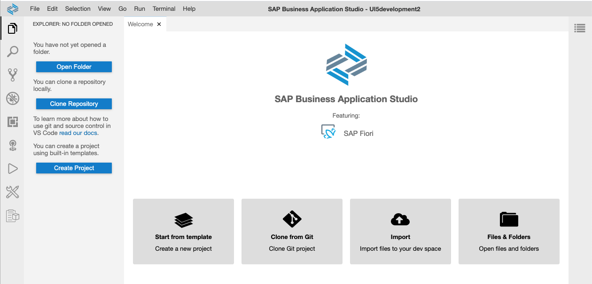  

2. Click on *SAP Fiori Application* on as template and click *Start*.
  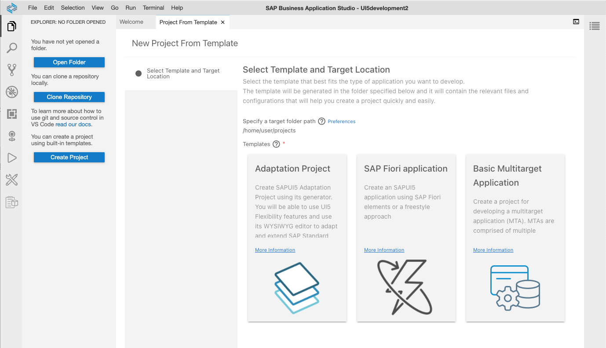  

3. Enter the following settings in the *Floorplan Selection* step: 
    1. Select *SAPUI5 freestyle* from the dropdown box.
    2. Select *SAPUI5 Application* as application template and click *Next*.</ol>
 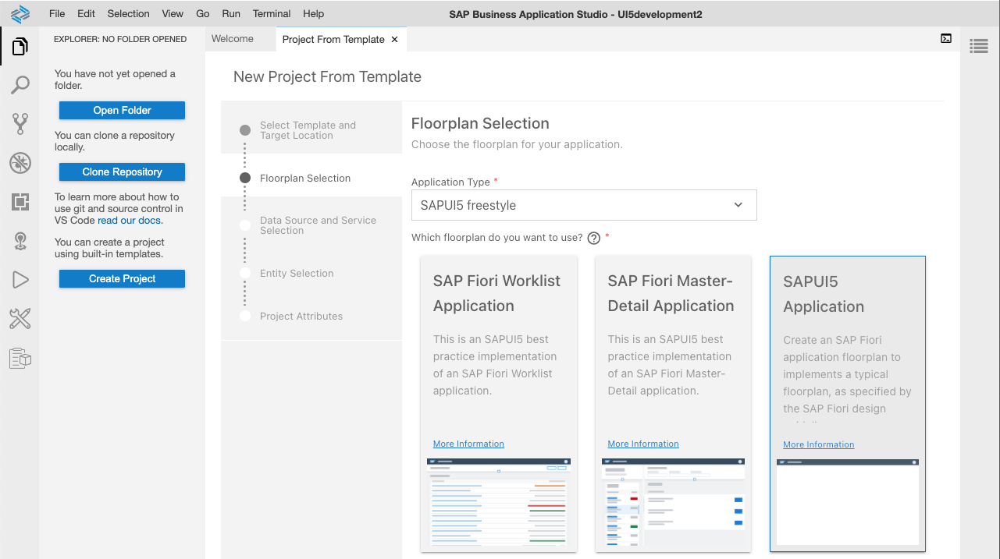  <ol>

4. Select *None* as Data Source, since we start without an external data source.
  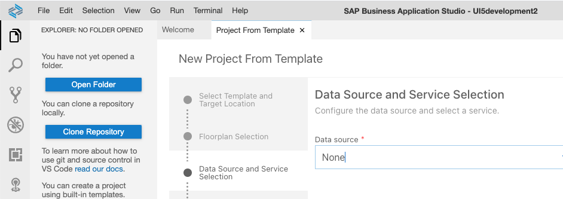  
   
5. Enter *App* as view name in the next step. (we don't really select an entity set, since we start without a data service).
    

6. Enter the following settings in the *Project Attributes* step:
    1. Enter *sensormanager* as *Module name*. 
    2. Choose *Sensor Manager* as *Application title*.
    3. Enter *keepcool* as your namespace.
    4. You can leave the description
    5. Leave the Project folder path as */home/user/projects* .
    6. Click *Finish*. </ol>
 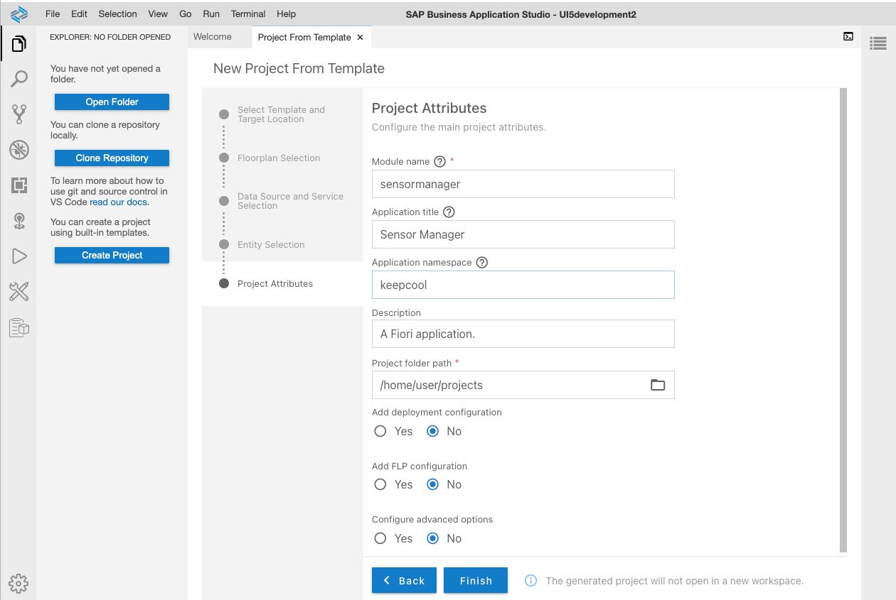  <ol>

7. The project is generated, and a notification window appears in the lower right corner. Click the blue *Open Folder* button at the top left of the screen.
   * [Optional] Click *File* in the header toolbar, select *Open Workspace* and pick the generated project.  </ul>
  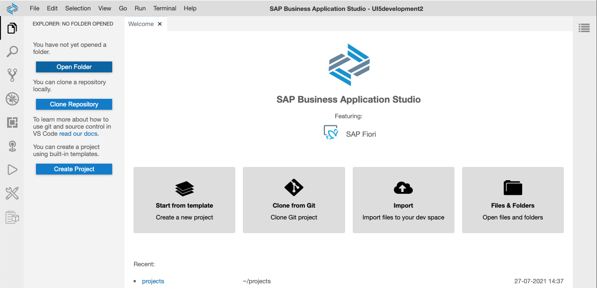  

8. Open the *projects* folder and select the *sensormanager* folder in the dialog and click *open*
  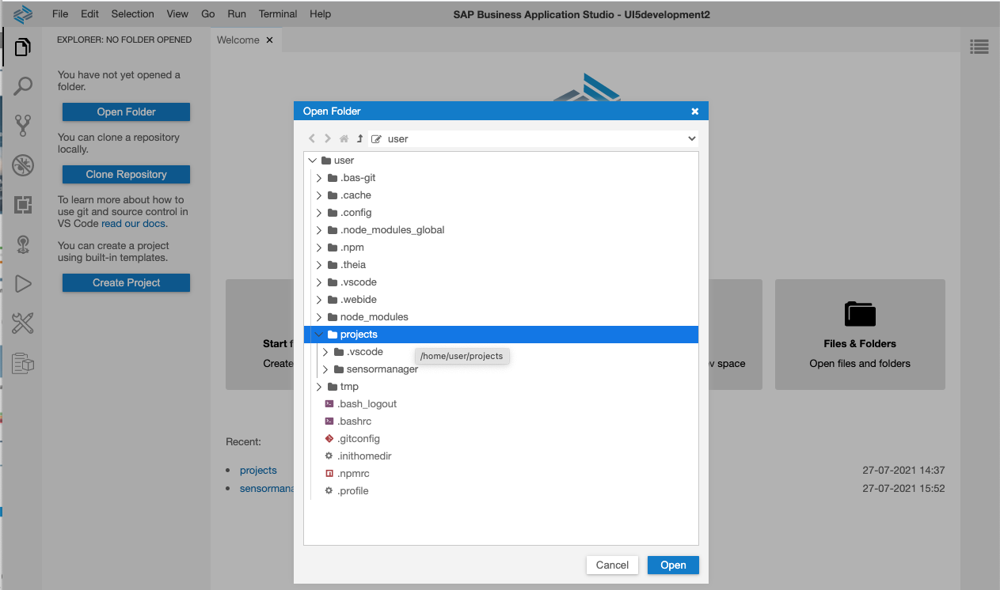  

## Exercise 1.2 - Create a Run Configuration

It's time for a first preview of your newly created application!

1. Create a Run Configuration in the Business Application Studio.
    1. Click the 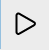 icon in the left icon bar.
    2. Click on *Create Configuration* 
    3. select *sensormanager (Fiori Tools)* from the dropdown at the top</ol>

  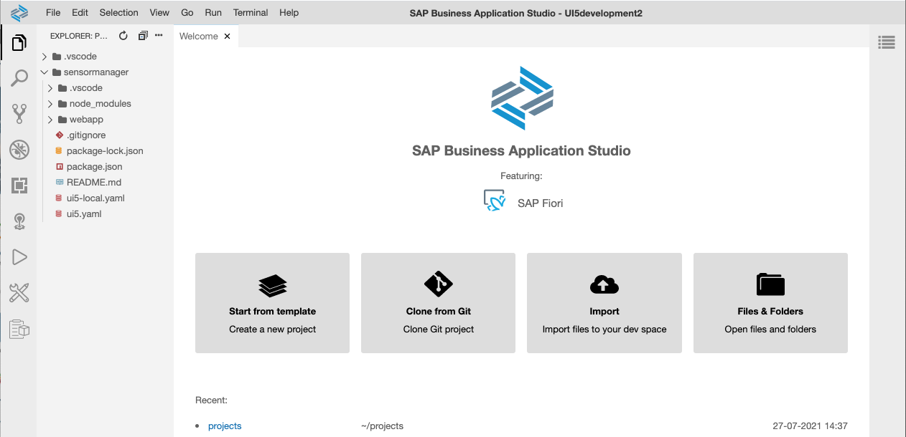  

2. Select *latest* as your UI5 version.
  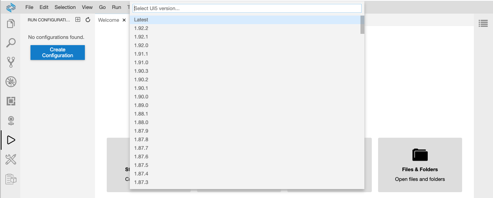  

3. Select *Skip* in the next dropdown listand leave the proposed name *sensormanager* in the next step.
  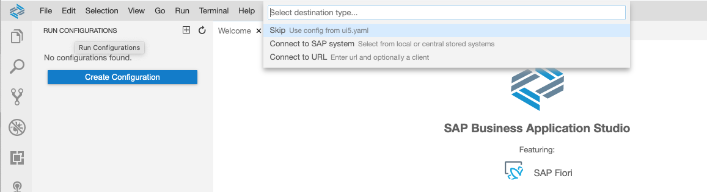  

4. A new configuration *sensormanager* should appear on the left. Select the new configuration and click the green icon *Run Module*.
  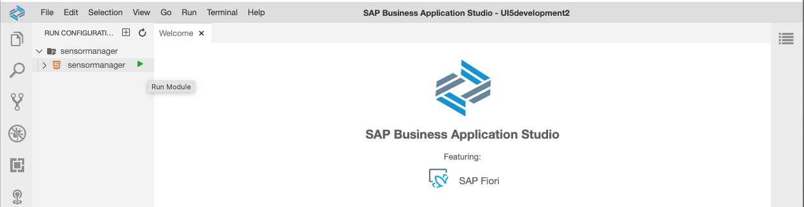  

5. The application is initialized. After a few seconds, the application is started in a new tab of your browser.
  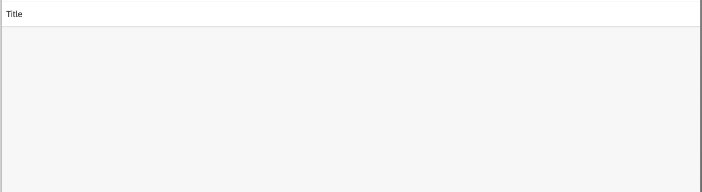  

## Summary

Hooray! You've successfully accomplished [Exercise 1 - Project Setup using SAP Business Application Studio](#exercise-1---project-setup-using-sap-business-applicationsstudio)!

Continue to [Exercise 2 - Basic UI5 Configuration and  View Creation](../ex2/README.md).
