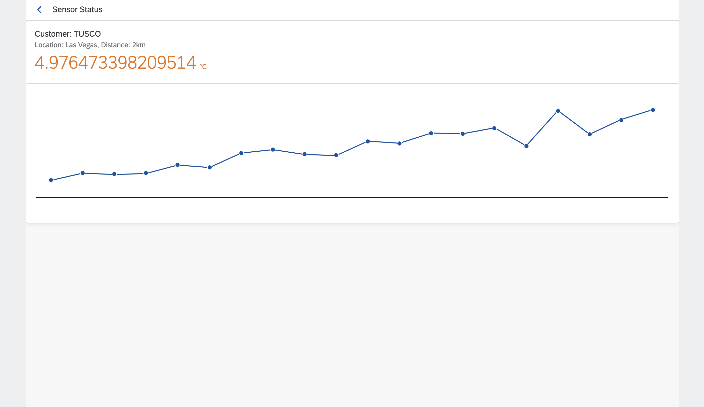
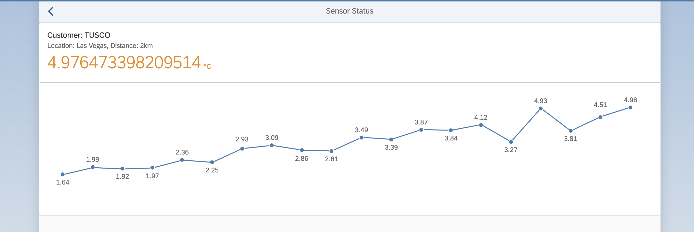
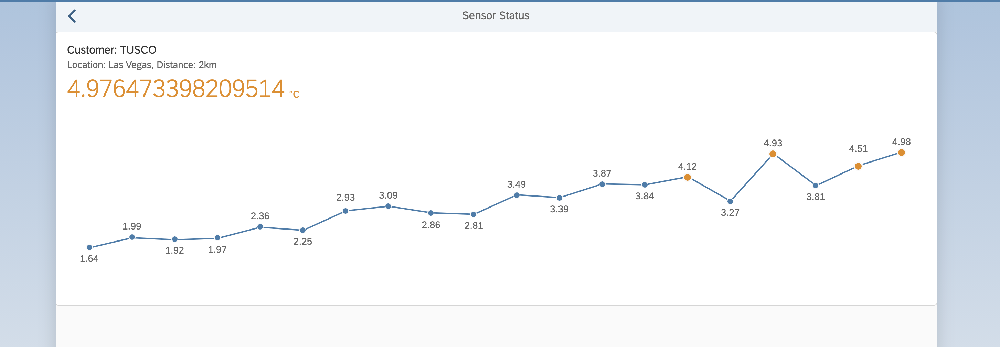
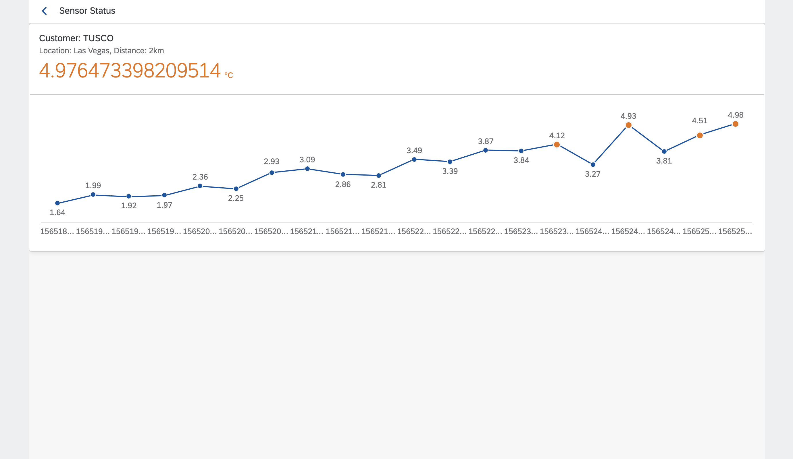

[](https://github.com/SAP-samples/teched2020-DEV164/tree/code/ex10/TechEd2020)
[](https://sap-samples.github.io/teched2020-DEV164/ex10/TechEd2020/SensorManager/webapp/)

# Exercise 10 - Chart with Data Binding

In this exercise you'll add some analytical flavor to your UI5 application by using a chart.

## Exercise 10.1 - Create the Chart

To show some historical data you can use the `temperatureLog` of the sensor data. You'll use an `sap.suite.ui.microchart.InteractiveLineChart`to add the data points.

1. Open `sensormanager/webapp/view/SensorStatus.view.xml`. 

2. Add the `sap.suite.ui.microchart` library to the `SensorStatus.view.xml`.

***SensorStatus/webapp/view/SensorStatus.view.xml***

````xml
<mvc:View displayBlock="true" 
    controllerName="keepcool.sensormanager.controller.SensorStatus"
    xmlns:mvc="sap.ui.core.mvc"
    xmlns="sap.m"
    xmlns:f="sap.f"
    xmlns:card="sap.f.cards"
    xmlns:mc="sap.suite.ui.microchart">
````

3. Add the chart to the content aggregation of the card and bind the `temperatureLog` to the `points` aggregation. For each point we'll display the `temperature` property.

***SensorStatus/webapp/view/SensorStatus.view.xml***

````xml
<f:content>
    <FlexBox width="100%" height="15rem" alignItems="Center" class="sapUiSmallMargin">
        <mc:InteractiveLineChart points="{sensorModel>temperatureLog}" displayedPoints="20" selectionEnabled="false">
            <mc:InteractiveLineChartPoint value="{sensorModel>temperature}"/>
        </mc:InteractiveLineChart>
    </FlexBox>
</f:content>
````

4. Switch to the browser tab where the application preview is opened. Click any sensor. Now the sensor status page contains a chart with a temperature history.
<br><br><br><br>

## Exercise 10.2 - Master the Chart

After completing the previous exercises, you are quite experienced in enhancing your UI5 application. Master your chart to show what you've learned.

1. Open `sensormanager/webapp/view/SensorStatus.view.xml`.

2. Add formatting to every data point to improve readability. You can use expression binding to achieve this.

***SensorStatus/webapp/view/SensorStatus.view.xml***

````xml
<mc:InteractiveLineChartPoint
    value="{=Number.parseFloat(${sensorModel>temperature}.toFixed(2))}"/>
````

3. Switch to the browser tab where the application preview is opened. Click any sensor. Now the sensor status page contains a chart with a temperature history with better readability.
<br><br><br><br>

4. Add semantic coloring to the data points with a formatter function.

***SensorStatus/webapp/view/SensorStatus.view.xml***

````xml
<mc:InteractiveLineChartPoint
    value="{=Number.parseFloat(${sensorModel>temperature}.toFixed(2))}"
    color="{parts: ['sensorModel>/threshold', 'sensorModel>temperature'], formatter:'.formatValueColor'}"/>
````

5. Switch to the browser tab where the application preview is opened. Click any sensor. Now the sensor status page contains a chart with a temperature history with colored data points.
<br><br><br><br>

6. Add labels to the chart to provide some contextual info to the user.

***SensorStatus/webapp/view/SensorStatus.view.xml***

````xml
<mc:InteractiveLineChartPoint
    value="{=Number.parseFloat(${sensorModel>temperature}.toFixed(2))}"
    color="{parts: ['sensorModel>/threshold', 'sensorModel>temperature'], formatter:'.formatValueColor'}"
    label="{sensorModel>time}"/>
````

7. Switch to the browser tab where the application preview is opened. Click any sensor. Now the sensor status page contains a chart with a temperature history with x-axis labels. 
<br><br><br><br>

8. Displaying the time as a date makes not much sense here. To improve readability you should format the label using a `UI5 DataType`. These types are predefined and can be configured individually regarding the input and output format.

***SensorStatus/webapp/view/SensorStatus.view.xml***

````xml
<mc:InteractiveLineChartPoint
    value="{=Number.parseFloat(${sensorModel>temperature}.toFixed(2))}"
    color="{parts: ['sensorModel>/threshold', 'sensorModel>temperature'], formatter:'.formatValueColor'}"
    label="{
        path: 'sensorModel>time',
        type: 'sap.ui.model.type.Time',
        formatOptions: {
            source: { pattern: 'timestamp' },
                style: 'short'
            }
        }"/>
````

9. Switch to the browser tab where the application preview is opened. Click any sensor. Now the sensor status page contains a chart with a temperature history with readable x-axis labels. 
<br><br><br><br>

## Summary

Congratulations, you've completed successfully [Exercise 10 - Chart with DataBinding](#exercise-10---chart-with-databinding)!

Continue to [Exercise 11 - Deployment to SAP BTP, Cloud Foundry runtime](../ex11/README.md).


## Further Information

* UI5 Microcharts: https://ui5.sap.com/#/topic/9cbe3f06465e47b8a136956034a718ed
* sap.suite.ui.microchart.InteractiveLineChart: https://ui5.sap.com/#/api/sap.suite.ui.microchart.InteractiveLineChart
* Formatting, Parsing, and Validating Data: https://ui5.sap.com/#/topic/07e4b920f5734fd78fdaa236f26236d8
* sap.ui.model.type.Time: https://ui5.sap.com/#/topic/91f322a06f4d1014b6dd926db0e91070
