[](https://github.com/SAP-samples/teched2020-DEV164/tree/code/ex11/TechEd2020)

# Exercise 11 - Deploy Your App to SAP Cloud Platform

In this exercise you'll learn how easy it is to deploy your application directly from SAP Business Application Studio to a Cloud Foundry environment hosted by SAP Cloud Platform.

## Exercise 11.1 - Create Space in Cloud Foundry

First of all, you need to create the space in your Cloud Foundry environment to host your newly created UI5 application.

1. Open the SAP Cloud Platform Trial by opening *https://cockpit.hanatrial.ondemand.com/cockpit/#/home/trial* in a new browser tab and click *Enter Your Trial Account*.
<br><br>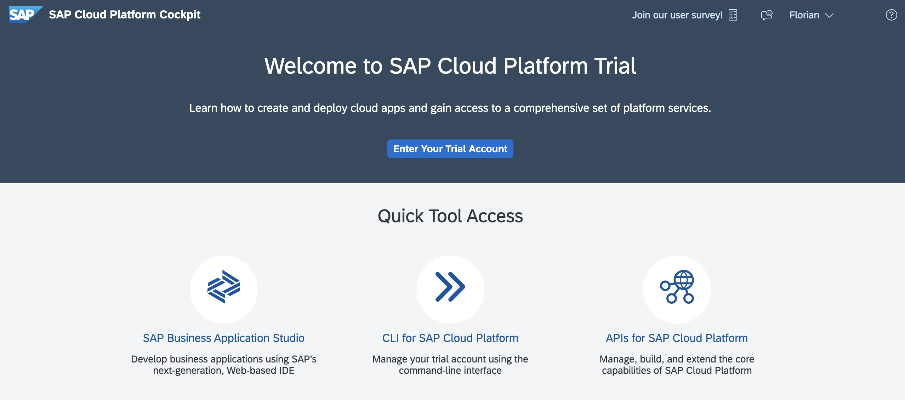<br><br><br>

2. You're redirected to your personal SAP Cloud Platform Cockpit where your subaccounts are listed. Click on the prefered subaccount, e.g. *trial*.
<br><br>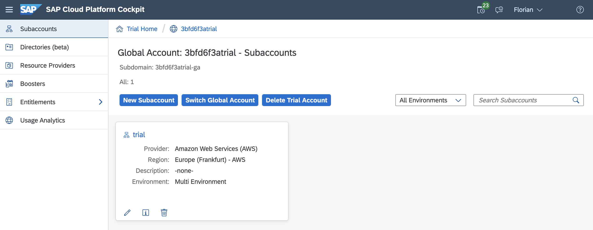<br><br><br>

3. Click the menu item *Spaces*. Until now, no space was created by you. Click *Create Space*.
<br><br>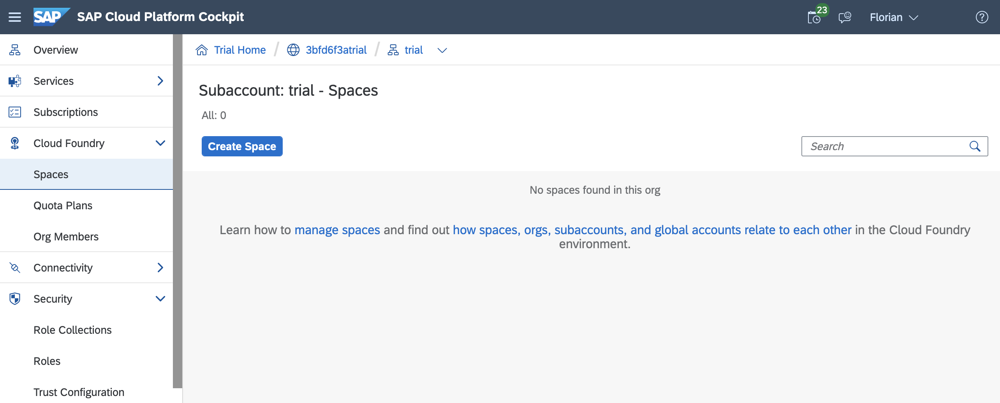<br><br><br>

4. In the popup, enter the space name, e.g. *ui5-apps*. Click *Create*.
<br><br>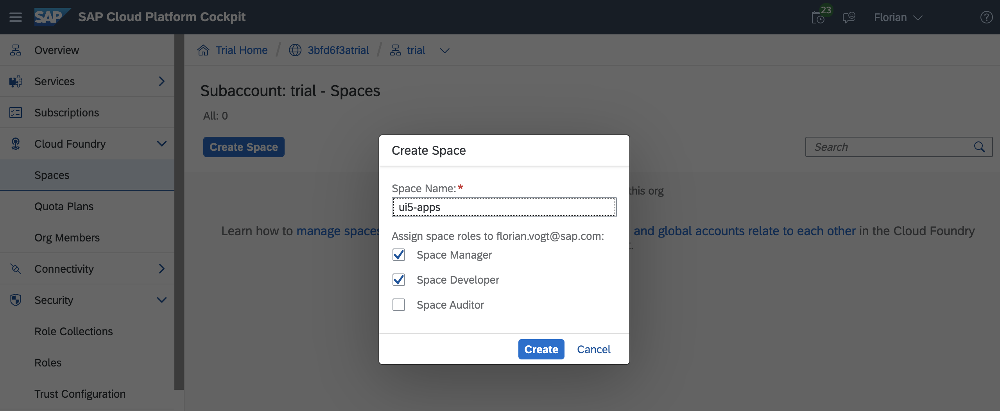<br><br><br>

5. The newly created space is displayed.
<br><br>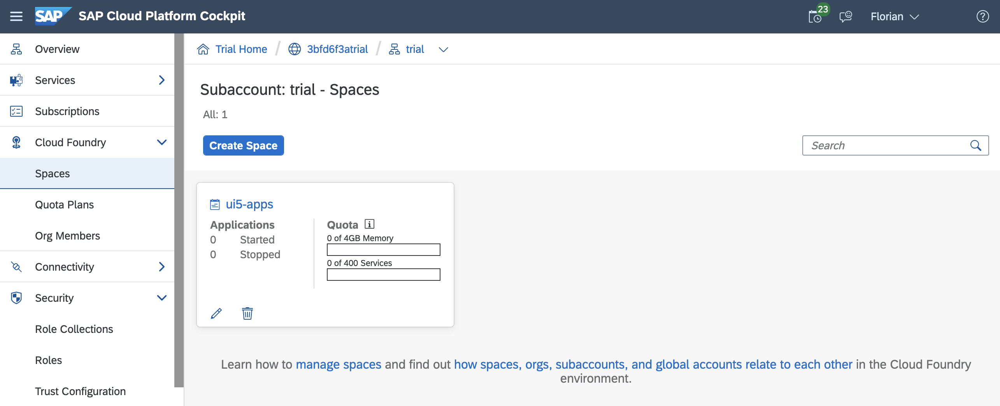<br><br><br>


## Exercise 11.2 - Login to Cloud Foundry

Now you can login to your Cloud Foundry environment directly from SAP Business Application Studio.

1. Open SAP Business Application Studio. Click in the header toolbar on *View* and then select *Find Command...*. Enter *CF: Login to cloud foundry*.
<br><br>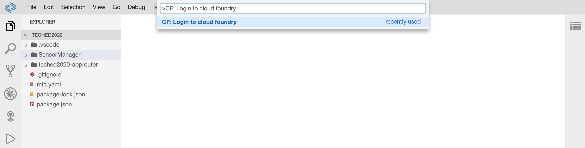<br><br><br>

2. Enter the Cloud Foundry endpoint you'd like to use. If your environment runs in the EU10 region, this is `https://api.cf.eu10.hana.ondemand.com`.
<br><br>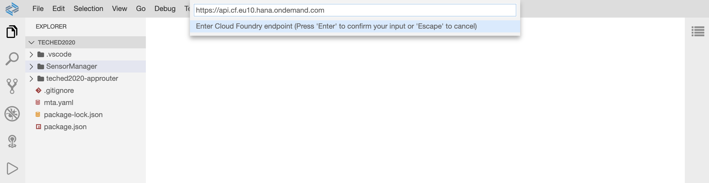<br><br><br>

3. Enter the email address you have used for registering your SAP Cloud Platform account.
<br><br>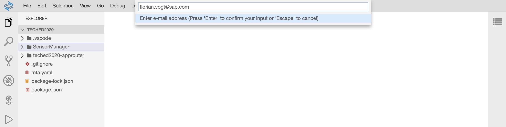<br><br><br>

4. Enter the password for your SAP Cloud Platform account.
<br><br>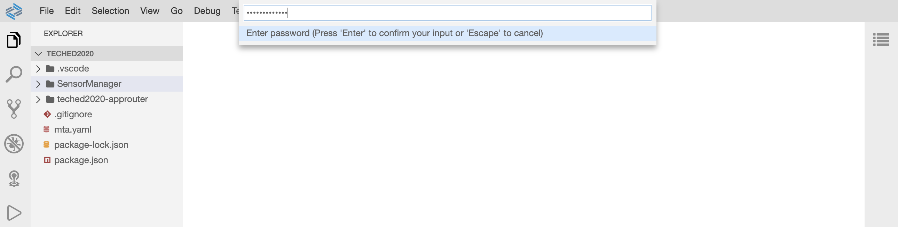<br><br><br>

5. After a few seconds a small window appears in the lower right corner notifying you that the login was successful.
<br><br>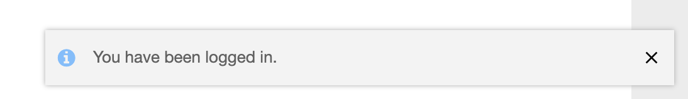<br><br><br>


## Exercise 11.3 - Set Organization and Space

After logging in you're asked to specify your desired Cloud Foundry organization and space.

1. Open SAP Business Application Studio and click in the header toolbar on *View* and then select *Find Command...*. Enter *CF: Set Org and Space*.
<br><br>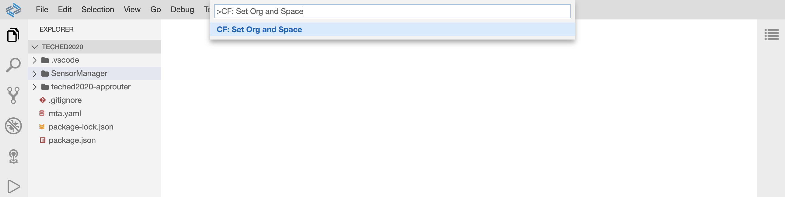<br><br><br>

2. Enter your Cloud Foundry organization name e.g. *ui5-cloud-foundry*.
<br><br>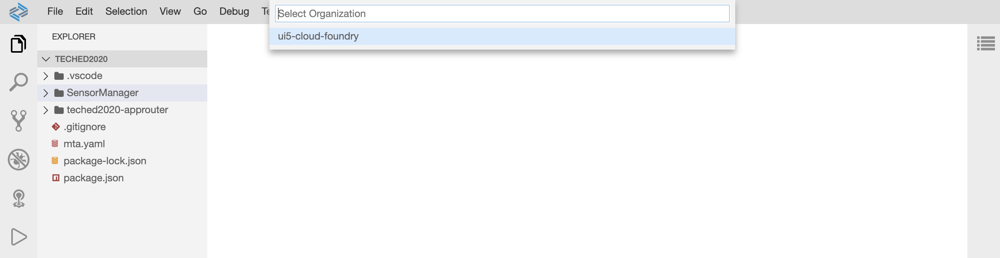<br><br><br>

3. Select your newly created space, e.g. *ui5-apps*.
<br><br>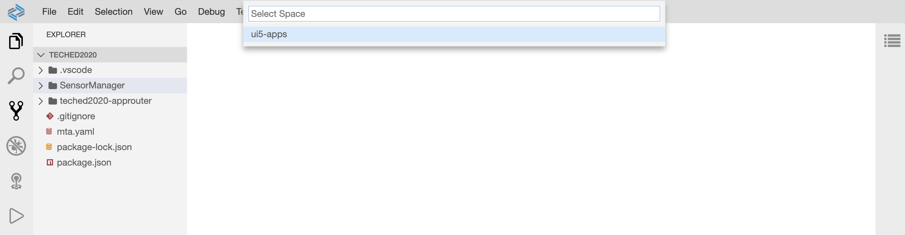<br><br><br>

4. After a few seconds a small window appears in the lower right corner notifying you that your organization and space have been set successfully.
<br><br>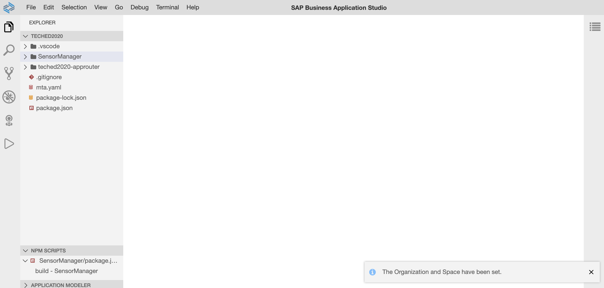<br><br><br>


## Exercise 11.4 - Configure the Approuter for Redirect

Your application will be available at `https://<approuter-url>/<app/id>`, and the application router will not redirect any traffic that hits the root URL. In this exercise, you will change this, so that your application will also be available at `https://<approuter-url>/`.

1. Open the file `SensorManager/webapp/manifest.json`.

2. Copy the value of the `sap.app/id` property. In your case, this should be *keepcool.SensorManager*.
<br><br>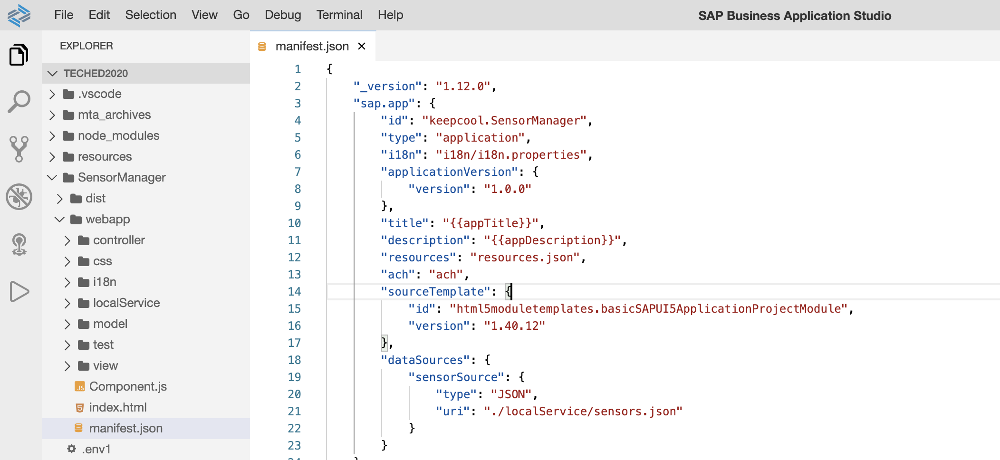<br><br><br>

3. Open the file `teched2020-approuter/xs-app.json`, add a property `welcomeFile` to define the redirect, paste the copied value of the previous step, and remove the dot from the value.

````json
{
  "authenticationMethod": "none",
  "welcomeFile": "keepcoolSensorManager",
  "routes": []
}
````

## Exercise 11.5 - Configure Your UI5 Application

Since you created your app using one of the application templates available in SAP Business Application Studio, all files which are located under `SensorManager/test/` and `SensorManager/localService/` are excluded from any build, because in a productive application these files are usually not needed. In our case the sensor data is placed in a local JSON file, so the `sensors.json` file needs to be included in the build. 

1. Open `SensorManager/ui5.yaml`. 

2. Remove the `"/localService/**"` entry for the `builder` section.

***SensorManager/ui5.yaml***

````yaml
builder:
  resources:
    excludes:
      - "/test/**"
````

## Exercise 11.6 - Build your Application

Now it's time to build your application. Yeah!

1. Right-click the `mta.yaml` file in the root folder.

2. Select *Build MTA*. The build starts.
<br><br>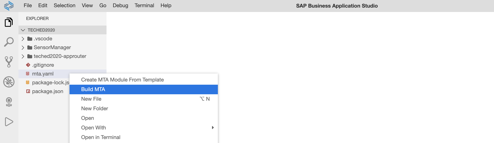<br><br><br>

3. Once the build has finished you'll be notified by a popup in the lower right corner.
<br><br>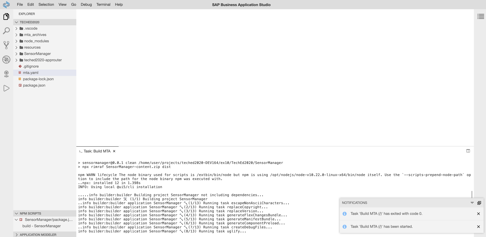<br><br><br>


## Exercise 11.7 - Deploy your Application

The build step has created a file named `TechEd2020_0.0.1.mtar` located under `mta_archives`. This file contains your build.

1. Right-click `mta_archives/TechEd2020_0.0.1.mtar` and select *Deploy MTA Archive*. Deployment starts.
<br><br>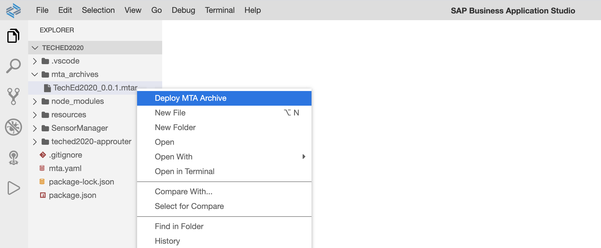<br><br><br>

2. Deployment should have finished after a few minutes, of which you'll be notified by a popup in the lower right corner.
<br><br>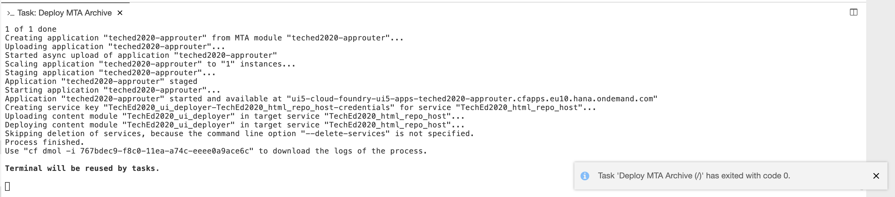<br><br><br>

3. In the deployment logs you'll find the URL of your deployed application. Copy it from the logs and paste it into a new browser tab.
<br><br>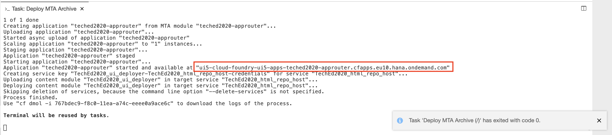<br><br><br>

4. Congratulations! You've deployed your UI5 application to SAP Cloud Platform Cloud Foundry.
<br><br>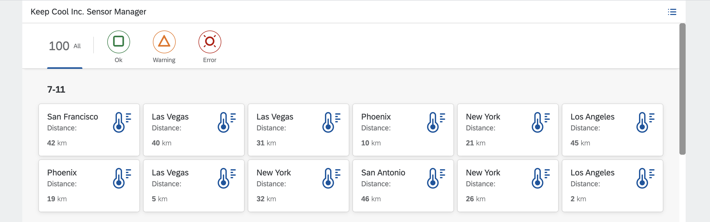<br><br><br>

## Summary

Hooray! You've completed successfully [Exercise 11 - Deployment to SAP Cloud Platform Cloud Foundry](#exercise-11---deployment-to-sap-cloud-platform-cloud-foundry).

And now it's time to celebrate! By mastering this session you've reached the first level in becoming a UI5 expert.
