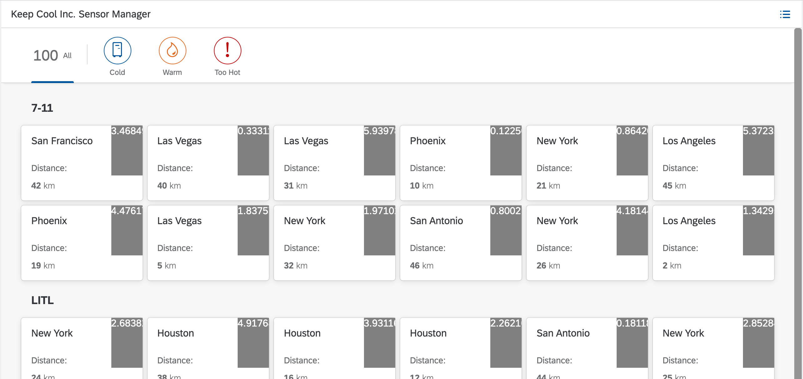
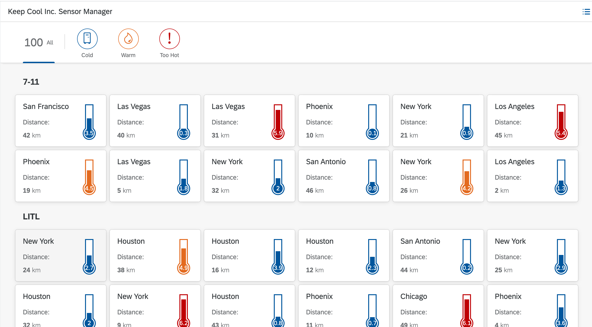

# Exercise 12 - Develop your own Control

In this exercise you'll create your own UI5 custom control. Although the color of the thermometer icons shows already the general state in the main page, we want to see the temperature value and the temperature also displayed graphically. Therefore we create a thermometer control which displays the temperatur with the color and the height of the scale directly.

## Exercise 12.1 - Create the custom control code

1. Create a new folder *control* in your project and create a file for the thermometer control code *thermometer.js* in this folder with the following code. The control just renders a simple `div` element which contains the temperature value as text. This will be later enhanced. 

***sensormanager/webapp/control/Thermometer.js***

````js
sap.ui.define([
	"sap/ui/core/Control"
], function (Control) {
	"use strict";
	return Control.extend("keepcool.sensormanager.control.Thermometer", {
		metadata : {
			properties : {
                value: 	{type : "float", defaultValue : 0},
                color: {type : "string"}
			},
			aggregations : {
			},
			events : {
			}
		},
		
		init : function () {
		},
		
		onclick: function(oEvent){
		}, 
				
		onAfterRendering : function () {  
		},
		
		renderer : {
			apiVersion : 2,
			render : function (oRM, oControl) {
				if (oControl.getValue()){
					oRM.openStart("div", oControl);
					oRM.class("thermometer-control");
					oRM.openEnd();
					  oRM.text(oControl.getValue());
					oRM.close("div");
				}
			}
		}
	});
});
````

2. Open `sensormanager/css/style.css`.

3. Add the css properties for the `div` element which is created by your thermometer control. In the first step it is just a grey square displaying the temparature.

***sensormanager/webapp/css/style.css***

````json
/* Enter your custom styles here */
.thermometer-control {
    width: 50px;
    height: 80px;
    text-align: center;
    color: white;
    background-color: gray;
}
````

3. Switch in the Sensors.view.xml from the icon control to your thermometer control. First define a namespace for the control folder like for a library:

***sensormanager/webapp/view/Sensors.view.xml***

````xml
<mvc:View
    controllerName="keepcool.sensormanager.controller.Sensors"
    xmlns:core="sap.ui.core"
    xmlns:mvc="sap.ui.core.mvc"
    xmlns:grid="sap.ui.layout.cssgrid"
    xmlns:f="sap.f"
    xmlns="sap.m"
    xmlns:cc="keepcool.sensormanager.control"
    displayBlock="true">
    <Page id="page" title="{i18n>title}">

````

4. Replace the icon control with your thermometer control in the view. It will use the same properties as the icon control.
   
***sensormanager/webapp/view/Sensors.view.xml***

````xml
  <HBox justifyContent="SpaceBetween">
    <VBox justifyContent="SpaceBetween" class="sapUiSmallMarginTop sapUiSmallMarginBegin">
      <Title text="{sensorModel>location}"/>
      <Label text="{i18n>distanceLabel}:"/>
    </VBox>
    <cc:Thermometer 
      value="{sensorModel>temperature/value}"
      color="{path: 'sensorModel>temperature/value', formatter:'.formatIconColor'}"/>
    <!--core:Icon 
      src="sap-icon://temperature" 
      color="{path: 'sensorModel>temperature/value', formatter:'.formatIconColor'}"
      size="2.5rem" 
      class="sapUiSmallMarginTop sapUiSmallMarginEnd"/-->
  </HBox>

````

1. Reload the preview page and you see the first simple version of your thermometer control. 

<br><br><br><br>   

## Exercise 12.2 - Beautify your Thermometer Control

Now you want to create a nice looking thermometer, which displays not only the temperature value as number but also with the height of the thermometer scale and with the same colors as the simple icon before.

1. Open `sensormanager/webapp/control/Thermometer.js`.

2. Enhance the code of the renderer to create several div elements which will used to paint a thermometer via css.

***sensormanager/webapp/control/Thermometer.js***

````js
		renderer : {
			apiVersion : 2,
			render : function (oRM, oControl) {
				if (oControl.getValue()){
					oRM.openStart("div", oControl);
					oRM.class("thermometer-control");
					oRM.openEnd();
                        oRM.openStart("div", oControl);
                        oRM.class("thermometer-tube");
                        oRM.class("sapUiIconBGColor" + oControl.getColor());
                        var h = Math.min(Number(oControl.getValue()*7).toPrecision(2), 50);
                        oRM.style("top", 74-h + "px");
                        oRM.style("height", h + "px");
                        oRM.openEnd();
                        oRM.close("div");
                        oRM.openStart("div", oControl);
                        oRM.class("thermometer-tube-bgw");
                        oRM.openEnd();
                        oRM.close("div");
                        oRM.openStart("div", oControl);
                        oRM.class("thermometer-tube-bgc");
                        oRM.class("sapUiIconBGColor" + oControl.getColor());
                        oRM.openEnd();
                        oRM.close("div");
                        oRM.openStart("div", oControl);
                        oRM.class("thermometer-bulb");
                        oRM.class("sapUiIconBGColor" + oControl.getColor());
                        oRM.openEnd();
                        oRM.close("div");
                        oRM.openStart("div", oControl);
                        oRM.class("thermometer-bulb-bgw");
                        oRM.openEnd();
                        oRM.close("div");
                        oRM.openStart("div", oControl);
                        oRM.class("thermometer-bulb-bgc");
                        oRM.class("sapUiIconBGColor" + oControl.getColor());
                        oRM.openEnd();
                        oRM.close("div");
                        oRM.openStart("div", oControl);
                        oRM.class("thermometer-value");
                        oRM.openEnd();
                        	oRM.text(Math.min(Number(oControl.getValue()).toFixed(1)));
                        oRM.close("div");
					oRM.close("div");
				}
			}
		}

````

1. Add the css properties for the `div` elements which are used to paint your thermometer control. It consists of three circles and three rectangular divs.

***sensormanager/webapp/css/style.css***

````json
/* Enter your custom styles here */
.thermometer-control {
    border: 1px;
    width: 50px;
    height: 70px;
    border-style: none;
}
.thermometer-tube {
    position: absolute;
    border: 1px;
    width: 10px;
    top: 20px;
    left: 9px;
    z-index: 5;
}
.thermometer-tube-bgw {
    position: absolute;
    border: 1px;
    width: 14px;
    height: 60px;
    background-color: white;
    top: 22px;
    left: 7px;
    z-index: 4;
}
.thermometer-tube-bgc {
    position: absolute;
    border: 1px;
    width: 18px;
    height: 64px;
    top: 20px;
    left: 5px;
    z-index: 3;
}
.thermometer-bulb {
    height: 20px;
    width: 20px;
    border-radius: 50%;
    position: absolute;
    top: 72px;
    left: 4px;
    z-index: 5;

}
.thermometer-bulb-bgw {
    height: 24px;
    width: 24px;
    background-color: white;
    border-radius: 50%;
    position: absolute;
    top: 70px;
    left: 2px;
    z-index: 4;

}
.thermometer-bulb-bgc {
    height: 28px;
    width: 28px;
    border-radius: 50%;
    position: absolute;
    top: 68px;
    left: 0px;
    z-index: 3;
}
.thermometer-value{
    position: absolute;
    width: 20px;
    top: 74px;
    left: 4px;
    z-index: 6;
    color: white;
    font-size: small;
    text-align: center;
}
````

4. Switch to the browser tab where the application preview is opened. Now you see your own custom control displaying the temperature also graphically for every icehouse.
<br><br><br><br>
 

## Further Information
* Developing Controls: https://ui5.sap.com/#/topic/8dcab0011d274051808f959800cabf9f.html
* Custom Controls: https://ui5.sap.com/#/topic/d12d2ee6a5454d799358d425f9e7c4db
