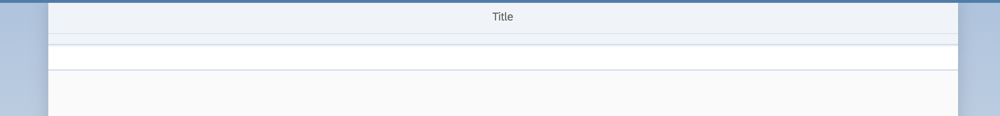

[](../../../../tree/gh-pages/ex2)
[](https://dirkelko.github.io/Developing-Apps-with-SAPUI5/ex2/sensormanager/webapp/)

# Exercise 2 - Basic UI5 Configuration and View Creation

In this exercise you'll add some content to your application. A new UI5 view showing multiple sensors will be the first part of your app.

## Exercise 2.1 - Check SAP Fiori 3

SAP Fiori 3 is SAP’s new target design system. It evolves the SAP Fiori design for all SAP products to fully support the Intelligent Suite, running on any device. SAP Business Application Studio by default generates UI5 projects based on SAP Fiori 3. In your UI5 application the SAP Fiori version is controlled by the UI5 theme. 

1. Click on the files icon at the top of the icon bar at the left and open `sensormanager/webapp/index.html`.

2. Check that the attribute `data-sap-ui-theme` has the value `sap_fiori_3`.

***sensormanager/webapp/index.html***

````html
<!DOCTYPE html>
<html>
    <head>
        <meta charset="utf-8" />
        <meta name="viewport" content="width=device-width, initial-scale=1.0" />
        <title>sensormanager</title>
        <script
            id="sap-ui-bootstrap"
            src="resources/sap-ui-core.js"
            data-sap-ui-theme="sap_fiori_3"
            data-sap-ui-resourceroots='{"keepcool.sensormanager": "./"}'
            data-sap-ui-compatVersion="edge"
            data-sap-ui-oninit="module:sap/ui/core/ComponentSupport"
            data-sap-ui-async="true"
			data-sap-ui-preload="async"
            data-sap-ui-frameOptions="trusted"
        ></script>
    </head>
    <body class="sapUiBody">
        <div
            data-sap-ui-component
            data-name="keepcool.sensormanager"
            data-id="container"
            data-settings='{"id" : "sensormanager"}'
        ></div>
    </body>
</html>
````

## Exercise 2.2 - Create Sensors.view.xml

After completing these steps you'll have written your first UI5 view.

1. Right-click on the `sensormanager/webapp/view` folder and select `New File`.
<br><br><br><br>

2. Enter `Sensors.view.xml` as file name and confirm.
<br><br><br><br>

3. Now we'll add some content to your newly created UI5 view. Let's start with an empty `sap.m.IconTabBar`.

***sensormanager/webapp/view/Sensors.view.xml***

````xml
<mvc:View
    xmlns:mvc="sap.ui.core.mvc"
    xmlns="sap.m"
    displayBlock="true">
    <Page id="page" title="{i18n>title}">
        <content>
            <IconTabBar id="iconTabBar" class="sapUiResponsiveContentPadding">
                <content>
                </content>
            </IconTabBar>
        </content>
    </Page>
</mvc:View>
````

## Exercise 2.3 - Add Dependencies

You will use several UI5 libraries like `sap.m` or `sap.f` in your application. The central point for configuring your UI5 application is the `manifest.json` file, which is located at `sensormanager/webapp/manifest.json`.

1. Open `sensormanager/webapp/manifest.json`.
2. Go to the section `sap.ui5`.
3. Add the `sap.f` and `sap.suite.ui.microchart` libraries to the `dependencies/libs` section. UI5 will take care of loading all the libraries listed here when your app is started.

***sensormanager/webapp/manifest.json***

````json
        "dependencies": {
            "minUI5Version": "1.93.0",
            "libs": {
                "sap.ui.core": {},
                "sap.ui.layout": {},
                "sap.m": {},
                "sap.f": {},
                "sap.suite.ui.microchart": {}
            }
        },
````

## Exercise 2.4 - Enable Routing for Sensors.view.xml

UI5 comes with a powerful routing API that helps you control the state of your application efficiently. It takes care of displaying the desired UI5 view based on the given browser URL hash.

Let's adjust the `manifest.json` to enable the routing feature for your newly created view.

1. Open `sensormanager/webapp/manifest.json`.
2. Go to the section `sap.ui5`.
3. Replace all content inside the `routing` property with the following content:

***sensormanager/webapp/manifest.json***

````json
        "routing": {
            "config": {
                "routerClass": "sap.m.routing.Router",
                "viewType": "XML",
                "async": true,
                "transition": "slide",
                "viewPath": "keepcool.sensormanager.view",
                "controlAggregation": "pages",
                "controlId": "app"
            },
            "routes": [{
                "name": "RouteSensors",
                "pattern": "",
                "target": ["TargetSensors"]
            }],
            "targets": {
                "TargetSensors": {
                    "viewType": "XML",
                    "transition": "slide",
                    "clearControlAggregation": false,
                    "viewId": "Sensors",
                    "viewName": "Sensors"
                }
            }
        }
````

4. Open the tab with the application preview and reload it. The application is being updated, and you can see an empty `sap.m.IconTabBar`.
  * [Optional] If you have closed the tab with the application preview accidentally, click in the header toolbar on *View* and then select *Find Command...*. Enter here *Ports: Preview* and confirm. A new tab with the application preview opens.</ul>

<br><br><br><br>

## Summary

You've now enabled routing for your application and prepared your application for further development. Stay tuned!

Continue to [Exercise 3 - Show Sensor Content](../ex3/README.md).


## Further Information

* UI5 Demokit: https://ui5.sap.com/
* Views in UI5: https://ui5.sap.com/#/topic/91f27e3e6f4d1014b6dd926db0e91070
* Routing in UI5: https://ui5.sap.com/#/topic/3d18f20bd2294228acb6910d8e8a5fb5
* SAP Fiori 3: https://experience.sap.com/fiori-design-web/sap-fiori/#sap-fiori-3
