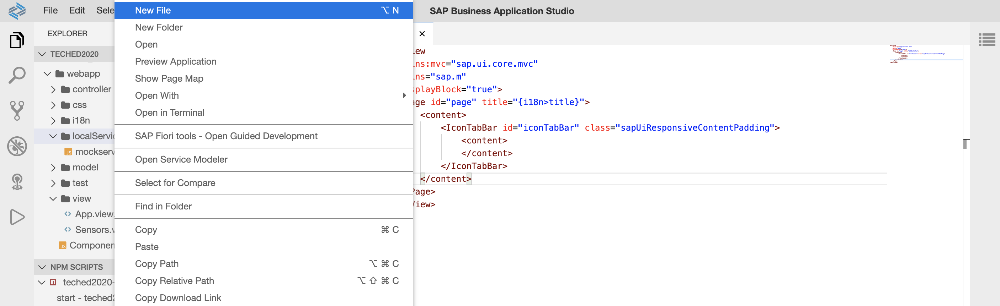
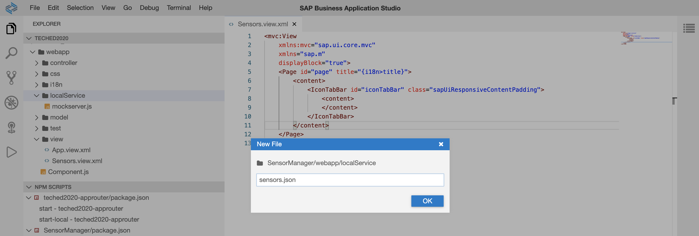
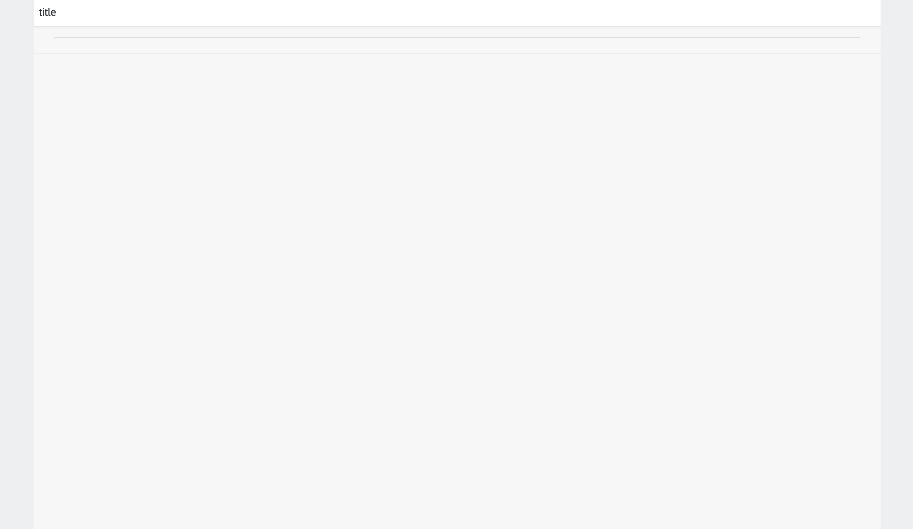
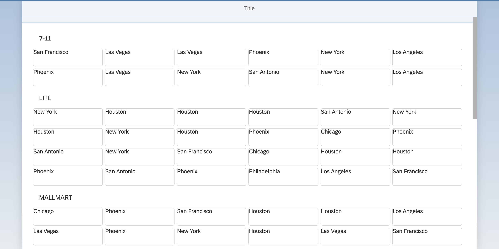

[](https://github.com/SAP-samples/teched2020-DEV164/tree/code/ex3/TechEd2020)
[](https://sap-samples.github.io/teched2020-dev164/exercises/ex3/TechEd2020/SensorManager/webapp/)

# Exercise 3 - Show Sensor Content

In this exercise you'll add a local data service to the application and display the data on the enhanced UI5 view.

## Exercise 3.1 - Import Sensor Data

To simulate a source providing sensor data, you'll now add some sensor data to your application.

1. Go to folder `SensorManager/webapp/localService`.

2. Right-click on the `localService` folder.

3. Select `New File`.
<br><br><br><br>

4. Enter `sensors.json` as file name.
<br><br><br><br>

5. Copy and paste the content of [sensors.json](data/sensors.json) into the newly created file.

## Exercise 3.2 - Configure a Data Service

After adding the sensor data to your application, you'll need to configure the data service which provides the sensor data.

1. Open the `manifest.json` file located under `SensorManager/webapp`.

2. Go to the section `sap.app`. Here, you add a new data source with name `sensorSource`, which points to the sensor data. (Please ensure that the whole attribute(s) in the manifest should be replaced that are provided in the code snippets.)

***SensorManager/webapp/manifest.json***

````json
"sap.app": {
    "dataSources": {
        "sensorSource": {
            "type": "JSON",
            "uri": "./localService/sensors.json"
        }
    }
}
````

1. Go to the section `sap.ui5`. Here, you add a new JSONModel with name `sensorModel`, which points to the newly created data source.

***SensorManager/webapp/manifest.json***

````json
"sap.ui5": {
    "models": {
        "sensorModel": {
            "type": "sap.ui.model.json.JSONModel",
            "dataSource": "sensorSource"
        }
    }
}
````

## Exercise 3.3 - Add a GridList

After configuring the data service, it's now time to enrich your `Sensors.view.xml` with some fancy UI5 controls!

1. Open the `Sensors.view.xml` located under `SensorManager/webapp/view`.

2. Add `sap.f` and `sap.ui.layout.cssgrid` to the xml namespace declarations to make sure that the required resources are available in your view.

***SensorManager/webapp/view/Sensors.view.xml***

````xml
<mvc:View
    xmlns:mvc="sap.ui.core.mvc"
    xmlns:grid="sap.ui.layout.cssgrid"
    xmlns:f="sap.f"
    xmlns="sap.m"
    displayBlock="true">
````

3. Add `sap.f.GridList` to the `content` aggregation of the IconTabBar. An aggregation is a special relation between two UI element types. It is used to define the parent-child relationship within the tree structure. The parent end of the aggregation has cardinality 0..1, while the child end may have 0..1 or 0..*. The element's API offers convenient and consistent methods to deal with aggregations (e.g. to get, set, or remove target elements). Examples are table rows and cells, or the content of a table cell.

***SensorManager/webapp/view/Sensors.view.xml***

````xml
<f:GridList id="sensorsList" noDataText="No sensors">
    <f:customLayout>
        <grid:GridBoxLayout/>
    </f:customLayout>
    <f:items>
        <CustomListItem>
        </CustomListItem>
    </f:items>
</f:GridList>
````

4. Switch browser tabs and refresh to see the updated UI5 application.
<br><br><br><br>

## Exercise 3.4 - Add Data Binding

After adding the `sap.f.GridList` control, you'll need to connect the control to the sensor data. For this, UI5 provides a mechanism called *Data Binding*.

1. Open the `Sensors.view.xml` located under `SensorManager/webapp/view`.

2. Bind the `items` aggregation of the `sap.f.GridList` to the path `sensorModel>/sensors`. Here, `sensorModel` is  the name of your recently defined data model, and `/sensors` points to a property inside it. As this is an array with several entries, you'd probably like to define sorting and grouping as well. In the `sorter` you can configure this by using the properties available:

***SensorManager/webapp/view/Sensors.view.xml***

````xml
<f:GridList id="sensorsList"
    items="{path: 'sensorModel>/sensors', sorter: {path:'customer', group:true, descending: false}}"
    noDataText="No sensors">
````

3. The list items are defined once as a template, which is then repeated multiple times to represent each entry of the sensors array. We also add some location details to our `sap.m.CustomListItem`. Here, `location` references the location property of each of the displayed sensor items.

***SensorManager/webapp/view/Sensors.view.xml***

````xml
<CustomListItem>
    <Title text="{sensorModel>location}"/>
</CustomListItem>
````

4. Let's see if our UI5 application displays the correct sensor data. Switch to the browser tab with the opened application preview and reload the page.
<br><br><br><br> 

## Summary

Congratulations! You've completed successully [Exercise 3 - Show Sensor Content](#exercise-3---show-sensor-content).

Continue to [Exercise 4 - Introduce Localization](../ex4/README.md).

## Further Information

* Data Binding: https://ui5.sap.com/#/topic/68b9644a253741e8a4b9e4279a35c247
