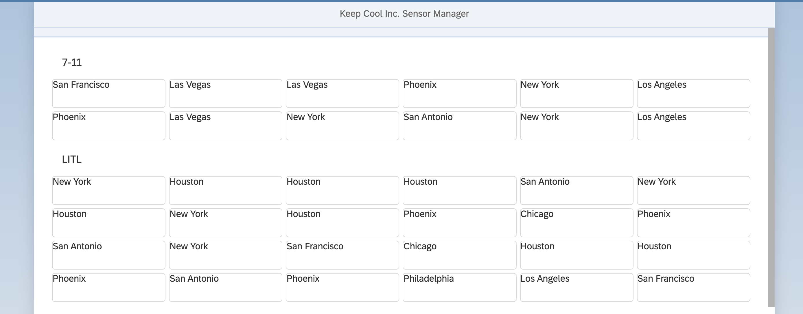
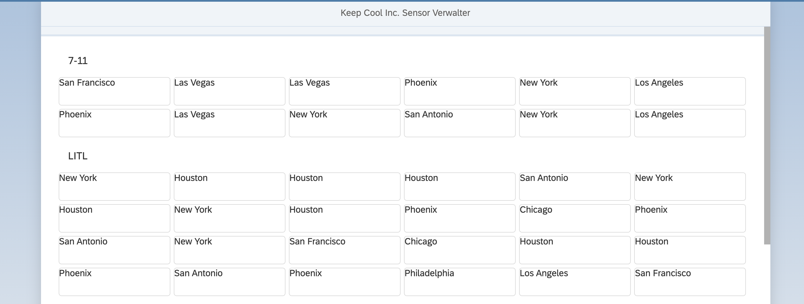

[](https://github.com/SAP-samples/teched2020-DEV164/tree/code/ex4/TechEd2020)
[](https://sap-samples.github.io/teched2020-dev164/exercises/ex4/TechEd2020/SensorManager/webapp/)

# Exercise 4 - Introduce Localization

In this exercise, you will learn how easy it is to enable your UI5 application for localization.

## Exercise 4.1 - Replacing Hard Coded Text with i18n Variables

In your existing UI5 application you've used hard coded text values. Thats ok, if you wanna implement a fast proof of concept. If you wanna build a productive application no hard coded text values should be used because they will be displayed no matter which browser language is configured. Your goal is to build an enterprise ready application which offeres also localization features, like text translation. UI5 comes with a huge set of localization features out of the box which are enabled by default. To benefit from these features you have to replace all occurrences of hard coded texts in your UI5 application. Luckily, its only one occurrence 😃. However, its a good reminder to start directly with localization in mind before refactoring many places in your application afterwards.

1. Open the `Sensors.view.xml` located under `SensorManager/webapp/view/`.

2. Replace the `noDataText` value with the i18n-key `noSensorDataText`.

````xml
<f:GridList id="sensorsList"
    items="{path: 'sensorModel>/sensors', sorter: {path:'customer', group:true, descending: false}}"
    noDataText="{i18n>noSensorDataText}">
````

3. Now, you've to add the newly introduced i18n-key also to your `i18n.properties` files which is located under `SensorManager/webapp/i18n/` and by the way lets also give your name a better title.

***SensorManager/webapp/i18n/i18n.properties***

````ini
title=Keep Cool Inc. Sensor Manager
appTitle=Sensor Manager
appDescription=The sensor manager
noSensorDataText=No Sensor Data
distanceLabel=Distance
distanceUnit=km
msgSensorDataLoaded=All sensors online!
msgFilterAll=All
msgFilterCold=Cold
msgFilterWarm=Warm
msgFilterHot=Too Hot
toolTipSelectCustomer=Select Customer
titleSelectCustomer=Select Customers
titleSensorStatus=Sensor Status
cardTitle=Customer: {0}
locationLabel=Location
cardSubTitle={0}: {1}, {2}: {3}{4}
temperatureUnit=°C
````

4. Switch the browser tab and perform a refresh to see how the UI5 application changed its user interface.
<br>

## Exercise 4.2 - Add New Languages

Your UI5 application is prepared for localization. No matter with which browser language is configured your UI5 application displays the texts of the `i18n.properties`-file.
Lets provide new language for english and german.

1. Go to folder `SensorManager/webapp/i18n/` and perform a right click.

2. In the opened popup, click on `New File`.

3. Enter `i18n_en.properties` as file name.

4. Repeat steps 1. and 2.

5. Enter `i18n_de.properties` as file name.

6. Open `i18n_en.properties` and paste following content.

***SensorManager/webapp/i18n/i18n_en.properties***

````ini
title=Keep Cool Inc. Sensor Manager
appTitle=Sensor Manager
appDescription=The sensor
noSensorDataText=No Sensor Data
distanceLabel=Distance
distanceUnit=km
msgSensorDataLoaded=All sensors online!
msgFilterAll=All
msgFilterCold=Cold
msgFilterWarm=Warm
msgFilterHot=Too Hot
toolTipSelectCustomer=Select Customer
titleSelectCustomer=Select Customers
titleSensorStatus=Sensor Status
cardTitle=Customer: {0}
locationLabel=Location
cardSubTitle={0}: {1}, {2}: {3}{4}
temperatureUnit=°C
````

7. Open `i18n_de.properties` and paste following content.

***SensorManager/webapp/i18n/i18n_de.properties***

````ini
title=Keep Cool Inc. Sensor Verwalter
appTitle=Sensor Verwalter
appDescription=Der Sensor Verwalter
noSensorDataText=Keine Sensordaten
distanceLabel=Distanz
distanceUnit=km
msgSensorDataLoaded=Alle Sensoren aktiv!
msgFilterAll=Alle
msgFilterCold=Kalt
msgFilterWarm=Warm
msgFilterHot=Zu Heiß
toolTipSelectCustomer=Wähle den Kunden
titleSelectCustomer=Wähle die Kunden
titleSensorStatus=Sensor Status
cardTitle=Kunde: {0}
locationLabel=Ort
cardSubTitle={0}: {1}, {2}: {3}{4}
temperatureUnit=°C
````

8. Depending on which browser language you've configured you would see a different texts on user interface.
    * If your language is English the content of `i18n_en.properties` is used
    * If your language is German the content of `i18n_de.properties` is used
    * If you any other language than English or German the content of `i18n.properties` is used

## Exercise 4.3 - Configure Supported Languages

Usually, only the `i18n.properties` file is maintained by developers. The language dependent files will be filled by native speakers or translators. You as an application developer can configure which languages are supported by your application and which language is your default (aka fallback) language. In your case English will be the default language and additionaly German should be supported.

1. Open the `manifest.json` located under `SensorManager/webapp`.

2. Go to section `sap.ui5` / `models` / `i18n`. Here you have to add two new configurations inside your settings object.
      1. Add the property `supportedLocales` and assigne the locales for German and English `["de", "en"]`
      2. Add the property `fallbackLocale` and assign the English locale `"en"`

***SensorManager/webapp/manifest.json***

````json
"i18n": {
  "type": "sap.ui.model.resource.ResourceModel",
  "settings": {
      "bundleName": "keepcool.SensorManager.i18n.i18n",
      "supportedLocales": ["de", "en"],
      "fallbackLocale": "en"
  }
}
````

3. Lets see if your UI5 application is able to start in English and German. Therefore switch to the browser tab with opened application preview. Perform a page reload. The UI5 application should start in English or in German if you have configured German as your browser language.
<br> 

4. UI5 provides an URL parameter to simulate another browser language. Therefore, add `?sap-ui-language=de` behind the URL in the browser. Now, the UI5 should start in German no matter which language you have configured as your browser language.
<br> 

5. You can simulate any other language e.g. English. Therefore, add `?sap-ui-language=en` behind the URL in the browser. Now, the UI5 should start in English no matter which language you have configured as your browser language.
<br>

5. Lets try to start the application in another not configured language. e.g Indian. Therefore, add `?sap-ui-language=in` behind the URL in the browser. Now, the UI5 should start in English, because you have configured English as your fallback locale. 
<br> 

If you wanna support Indian or any other prefered language feel free to repeat the steps described in [Exercise 4.2 Add New Languages](#exercise-42---add-new-languages) with the desired language.

## Summary

Yay! You've accomplished successfully [Exercise 4 - Introduce Localization](#exercise-4---introduce-localization). 

Continue to [Exercise 5 - Improve Visualization](../ex5/README.md).

## Further Information

* Localization: https://ui5.sap.com/#/topic/91f217c46f4d1014b6dd926db0e91070
* Supported Locales and Fallback: https://ui5.sap.com/#/topic/ec753bc539d748f689e3ac814e129563
