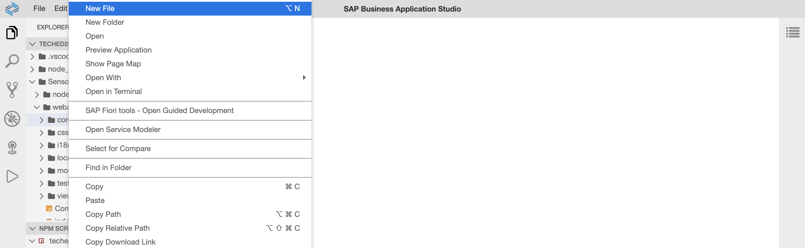
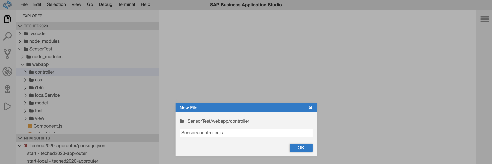
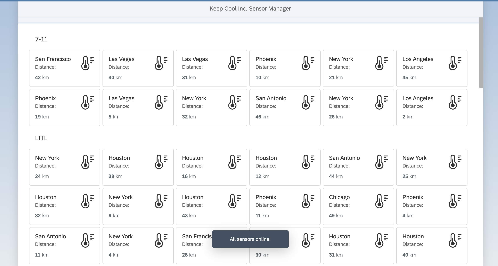
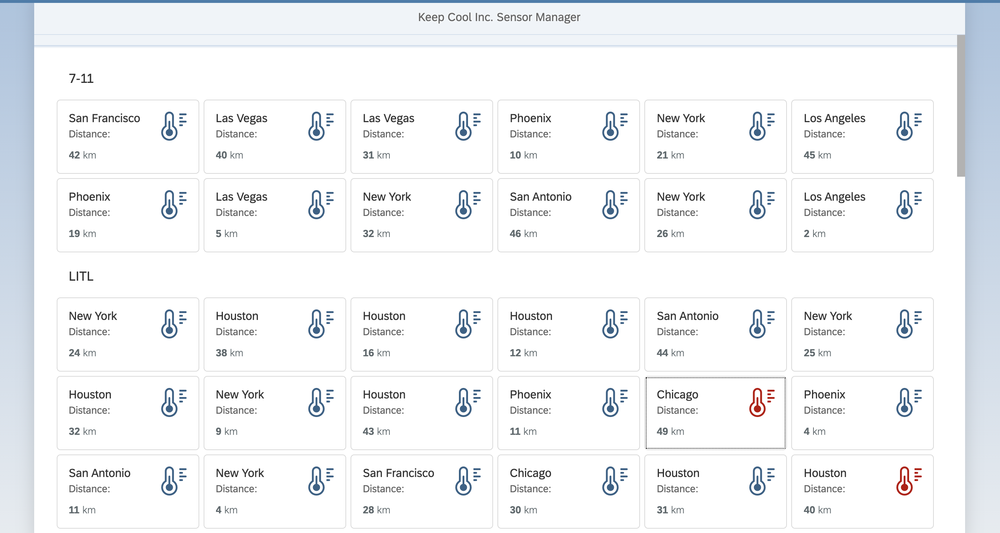

# Exercise 5 - Improve Visualization
You achieved a lot in the previous exercises. Now, its time to pimp your UI5 application with some visual effects.

## Exercise 5.1 - Enhance Sensors.view.xml
To give the customer the best possible overview, add some color to your application! Therefore you introduce a new layout and structure for the item and also show an `sap.ui.core.Icon` there.

1. Open `Sensors.view.xml` and add the xml namespace `xmlns:core="sap.ui.core` to the view to have the `sap.ui.core.Icon` available.

***SensorTest/webapp/view/Sensors.view.xml***

````xml
...
<mvc:View
    xmlns:core="sap.ui.core"
    xmlns:mvc="sap.ui.core.mvc"
    xmlns:grid="sap.ui.layout.cssgrid"
    xmlns:f="sap.f"
    xmlns="sap.m"
    displayBlock="true">
...
````

2. Add a temperature icon and layouting to the `sap.m.CustomListItem`. `sapUiSmallMarginTop` and `sapUiSmallMarginEnd` are predefined device agnostic css classes which add spacing to controls. `sap.m.HBox`and `sap.m.VBox` are helpers for layouting your application.

***SensorTest/webapp/view/Sensors.view.xml***

````xml
<CustomListItem type="Active">
    <layoutData>
        <FlexItemData growFactor="1" shrinkFactor="0"/>
    </layoutData>
    <HBox justifyContent="SpaceBetween">
        <VBox justifyContent="SpaceBetween" class="sapUiSmallMarginTop sapUiSmallMarginBegin">
            <Title text="{sensorModel>location}"/>
            <Label text="{i18n>distanceLabel}:"/>
        </VBox>
        <core:Icon src="sap-icon://temperature" size="2.5rem"
            class="sapUiSmallMarginTop sapUiSmallMarginEnd"/>
    </HBox>
  <HBox justifyContent="SpaceBetween" class="sapUiTinyMarginTop sapUiSmallMarginBottom sapUiSmallMarginBeginEnd">
        <ObjectNumber number="{sensorModel>distance}" unit="{i18n>distanceUnit}"/>
    </HBox>
</CustomListItem>
````

## Exercise 5.2 - Create Sensors.controller.js
In this exercise you'll enhance your application with some additional controller coding. 

1. Go to folder `SensorTest/webapp/controller/`.

2. Perform a right click on the `controller` folder and click on `New File`.
<br>

3. Enter `Sensors.controller.js` as file name.
<br>

4. All functions defined in the Controller can be used in your View. This gives you more flexibility to implement specific functionality to improve the visualization in your View. Copy and paste following code into `Sensors.controller.js`.

***SensorTest/webapp/controller/Sensors.controller.js***

````js
sap.ui.define([
		"sap/ui/core/mvc/Controller"
	],
	function (Controller) {
		"use strict";

		return Controller.extend("keepcool.SensorsTest.controller.Sensors", {
			onInit: function () {

			}
		});
	});
````

5. Add the modules `sap/ui/core/IconColor` and `sap/m/MessageToast` as dependencies to the `Sensors.controller.js`. You'll use them lateron during this exercise.

***SensorTest/webapp/controller/Sensors.controller.js***

````js
sap.ui.define([
    "sap/ui/core/mvc/Controller",
    "sap/ui/core/IconColor",
    "sap/m/MessageToast"
    ], function (Controller, IconColor, MessageToast) {
    "use strict";
````

6. Your next goal is to show a `sap.m.MessageToast` when your sensor data is loaded. Therefore paste following content to the `onInit` function in the `Sensors.controller.js`.

***SensorTest/webapp/controller/Sensors.controller.js***

````js
onInit: function() {
    this._oSensorModel = this.getOwnerComponent().getModel("sensorModel");
    this._oSensorModel.dataLoaded().then(function() {
        this._oThreshold = this._oSensorModel.getProperty("/threshold");
        MessageToast.show(this.getOwnerComponent().getModel("i18n").getResourceBundle().getText("msgSensorDataLoaded"), { closeOnBrowserNavigation: false });
    }.bind(this));
}
```` 

## Exercise 5.3 - Assign Controller to View
Now, its time to tell the view which controller is associated with it. 

1. Open `SensorTest/webapp/view/Sensors.view.xml`.

2. Add the `controllerName` attribute to the view and give the controller name `keepcool.SensorTest.controller.Sensors`. This is necessary as then the Controller's functions can be used in the View. UI5 maps this path to the `SensorTest/webapp/controller/Sensors.controller.js`.

***SensorTest/webapp/view/Sensors.view.xml***

````xml
<mvc:View
    controllerName="keepcool.SensorTest.controller.Sensors"
    xmlns:core="sap.ui.core"
    xmlns:mvc="sap.ui.core.mvc"
    xmlns:grid="sap.ui.layout.cssgrid"
    xmlns:f="sap.f"
    xmlns="sap.m"
    displayBlock="true">
...
````

3. Lets see if your UI5 application is able to show the `sap.m.MessageToast`. Therefore switch to the browser tab with the opened application preview. Perform a page reload. The `sap.m.MessageToast` should be displayed and confirms that your sensor data is loaded successfully.
<br>

## Exercise 5.4 - Create your first Formatter
Now, your goal is to bring some color to the user interface. Based on the actual temperature of the sensor you want to display the icon in the according color. Therefore you can use the formatter concept of UI5.

1. Open `SensorTest/webapp/controller/Sensors.controller.js`. 

2. Add the new function `formatIconColor`. 

***SensorTest/webapp/controller/Sensors.controller.js***

````js
formatIconColor: function(iTemperature) {
    if (iTemperature < this._oThreshold.warning) {
        return IconColor.Default;
    } else if (iTemperature >= this._oThreshold.warning && iTemperature < this._oThreshold.error) {
        return IconColor.Critical;
    } else {
        return IconColor.Negative;
    }
}
````

## Exercise 5.5 - Add the Formatter in your View
You're almost at the finish. The last piece is adding the newly created formatter function to the binding of your icon.

1. Open `SensorTest/webapp/view/Sensors.view.xml`. 

2. Add the `color` property to the `sap.ui.core.Icon` definition, bind the `color` property to path `sensors>temperature/value` and assign the formatter function to the binding.

***SensorTest/webapp/view/Sensors.view.xml***

````xml
<core:Icon src="sap-icon://temperature" size="2.5rem"
    color="{path: 'sensorModel>temperature/value', formatter:'.formatIconColor'}"
    class="sapUiSmallMarginTop sapUiSmallMarginEnd"/>
````

3. Lets see if your UI5 application is showing colored icons depending on the sensor data. Therefore switch to the browser tab with the opened application preview. Perform a page reload. The icons of the sensors are displayed either in blue (neutral), yellow (warning) or red (negative).
<br>

## Summary

Congratulations, you achieved the [Exercise 5 - Improve Visualization](#xxercise-5---improve-visualization) exercise.

Continue to [Exercise 6 - Filtering with the IconTabBar](../ex6/README.md).

## Further Information
* Model View Controller Concept: https://ui5.sap.com/#/topic/91f233476f4d1014b6dd926db0e91070 
* Controller: https://ui5.sap.com/#/topic/121b8e6337d147af9819129e428f1f75
* Formatting, Parsing, and Validating Data: https://ui5.sap.com/#/topic/07e4b920f5734fd78fdaa236f26236d8
