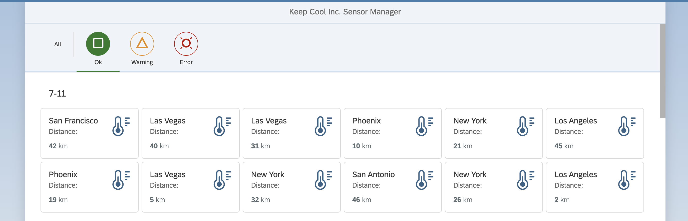
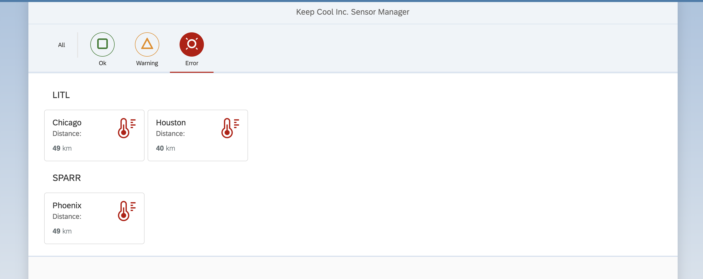
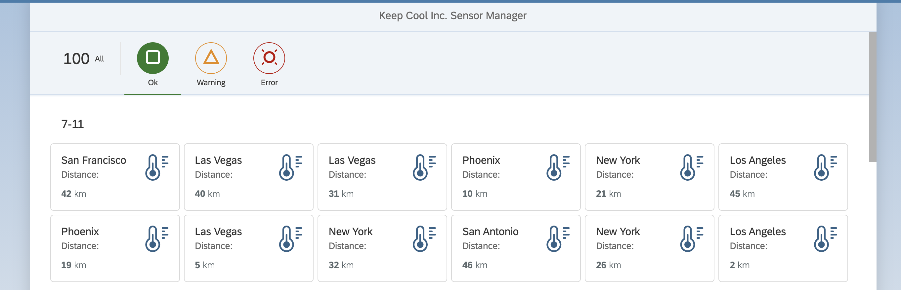

[](https://github.com/SAP-samples/teched2020-DEV164/tree/code/ex6/TechEd2020)
[](https://sap-samples.github.io/teched2020-dev164/exercises/ex6/TechEd2020/SensorManager/webapp/)

# Exercise 6 - Filtering with the IconTabBar

As your customer needs the full overview to make decisions quickly, you will give him an option to narrow down the list of sensors, based on the actual temperature of a sensor.

## Exercise 6.1 - Add new IconTabFilters to the Sensors.view.xml

Therefore we enhance our `sap.m.IconTabBar`.

1. Open `SensorManager/webapp/view/Sensors.view.xml`.

2. Add `sap.m.IconTabFilter` elements to the items aggregation of the `sap.m.IconTabBar`. Those will be visible as Icons on top of the bar and the user can click them to filter the list.

***SensorManager/webapp/view/Sensors.view.xml***

````xml
...
<IconTabBar id="idIconTabBar" class="sapUiResponsiveContentPadding">
    <items>
        <IconTabFilter showAll="true" text="{i18n>msgFilterAll}" key="All"/>
        <IconTabSeparator/>
        <IconTabFilter icon="sap-icon://status-positive" iconColor="Positive" text="{i18n>msgFilterOk}" key="Ok"/>
        <IconTabFilter icon="sap-icon://status-critical" iconColor="Critical" text="{i18n>msgFilterWarning}" key="Warning"/>
        <IconTabFilter icon="sap-icon://status-error" iconColor="Negative" text="{i18n>msgFilterError}" key="Error"/>
    </items>
    <content>
````

3. Lets see if your UI5 application is showing the newly introduced `sap.m.IconTabBarFilter` Therefore switch to the browser tab with the opened application preview. Perform a page reload.
<br>

## Exercise 6.2 - Implement the Filtering

In previous section you've added all necessary controls. Now, you've to implement the filtering logic.

1. 1. Open `SensorManager/webapp/controller/Sensors.controller.js`.

2. Add the module `sap/ui/model/Filter` as dependency to the `Sensors.controller.js`.

***SensorManager/webapp/controller/Sensors.controller.js***

````js
sap.ui.define([
    "sap/ui/core/mvc/Controller",
    "sap/ui/core/IconColor",
    "sap/m/MessageToast",
    "sap/ui/model/Filter"
    ], function (Controller, IconColor, MessageToast, Filter) {
    "use strict";
````

3. Implement the `onSensorSelect` function for filtering the sensor list items checking the `status` property. We make also use of the previously defined threshold and use some settings of the filter to narrow down the result. `LT` for example means "lower-than".

***SensorManager/webapp/controller/Sensors.controller.js***

````js
onSensorSelect: function (oEvent) {
    this._aCustomerFilters = [];
    this._aStatusFilters = [];

    var oBinding = this.getView().byId("sensorsList").getBinding("items"),
        sKey = oEvent.getParameter("key"),
        oThreshold = this.getSensorModel().getProperty("/threshold");

    if (sKey === "Ok") {
        this._aStatusFilters = [new Filter("temperature/value", "LT", oThreshold.warning, false)];
    } else if (sKey === "Warning") {
        this._aStatusFilters = [new Filter("temperature/value", "BT", oThreshold.warning, oThreshold.error, false)];
    } else if (sKey === "Error") {
        this._aStatusFilters = [new Filter("temperature/value", "GT", oThreshold.error, false)];
    } else {
        this._aStatusFilters = [];
    }

    oBinding.filter(this._aStatusFilters);
}
````

## Exercise 6.3 - Assign the Filtering to the IconTabBar

The filtering logic is writtem. Now, you have to assign the filtering function to the binding of the `sap.m.IconTabBar`.

1. Open `SensorManager/webapp/view/Sensors.view.xml`.

2. Bind the `onSensorSelect` function to `select` event of the `IconTabBar`. Each time one of the `sap.m.IconTabBarFilter` is clicked, this function will be called.

***SensorManager/webapp/view/Sensors.view.xml***

````xml
<IconTabBar id="idIconTabBar" select=".onSensorSelect" class="sapUiResponsiveContentPadding">
````

3. Lets see if your UI5 application is filtering the sensor data correctly. Therefore switch to the browser tab with the opened application preview. Perform a page reload. Click on the *Error* icon. Only sensors with too high temperature are displayed.
<br>

## Exercise 6.4 - Display the total number of sensors in every IconTabFilter

Your customer wishes to display the amount of sensors. Therefore, you can introduce the `count` property of `sap.m.IconTabFilter`.

1. Open `SensorManager/webapp/view/Sensors.view.xml`.

2. Make use of an expression binding by adding the `count` property and the expression binding `{=${sensorModel>/sensors}.length}`.

***SensorManager/webapp/view/Sensors.view.xml***

````xml
<IconTabBar id="idIconTabBar" select=".onSensorSelect" class="sapUiResponsiveContentPadding">
    <items>
        <IconTabFilter showAll="true" text="{i18n>msgFilterAll}" key="All" count="{=${sensorModel>/sensors}.length}"/>
````

3. Lets see if your UI5 application is displaying the total number of sensors correctly. Therefore switch to the browser tab with the opened application preview. Perform a page reload. Do you see *100*? Yeah!
<br>

## Summary

Hooray! You've successfully accomplished [Exercise 6 - Filtering with the IconTabBar](#exercise-6---filtering-with-the-icontabbar). 

Continue to [Exercise 7 - Fragment containing a SelectDialog](../ex7/README.md).

## Further Information

* Model Filter in UI5: https://ui5.sap.com/#/topic/5295470d7eee46c1898ee46c1b9ad763
* Expression Binding: https://ui5.sap.com/#/topic/daf6852a04b44d118963968a1239d2c0
