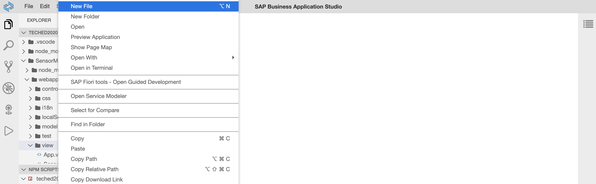
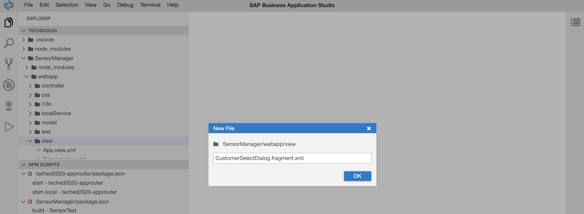
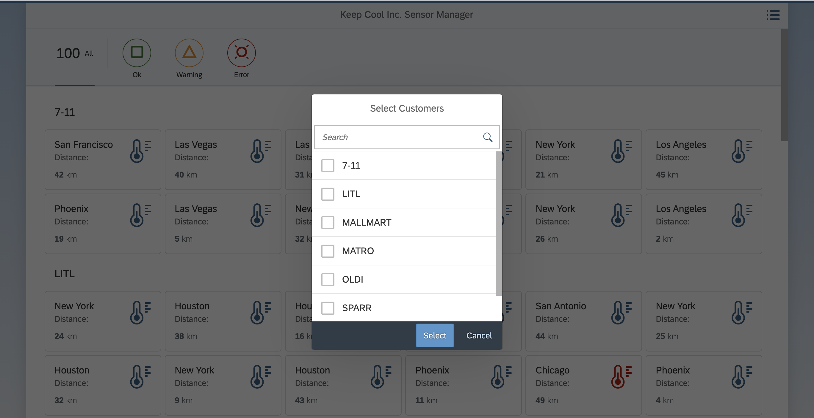
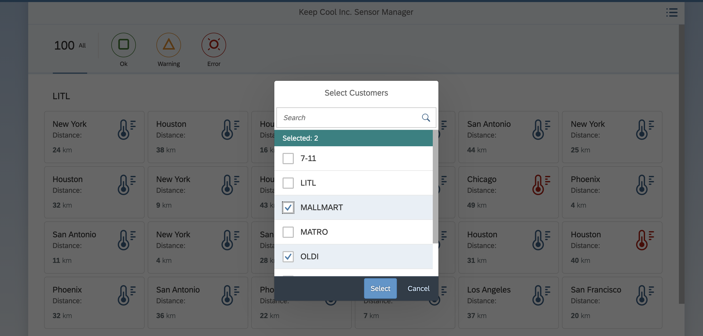
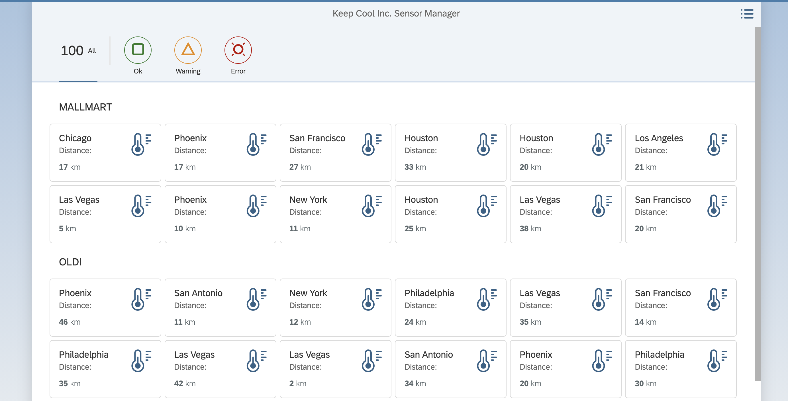

[](https://github.com/SAP-samples/teched2020-DEV164/tree/code/ex7/TechEd2020)
[](https://sap-samples.github.io/teched2020-DEV164/ex7/TechEd2020/SensorManager/webapp/)

# Exercise 7 - Fragment Containing a SelectDialog

Not all the icehouse data might be relevant for every employee of your customer. You should add some kind of basic personalization to the application. You can do this by providing a dialog in which users can select only the icehouse clients relevant for them.

## Exercise 7.1 - Create a new Fragment Definition

A dialog is a perfect scenario in which to use a `sap.ui.core.Fragment`. This UI5 artefact allows you to modularize your code in smaller reusable pieces.

1. Go to folder `SensorManager/webapp/view/`.

2. Right-click on the `view` folder and select `New File`.
<br><br><br><br>

3. Enter `CustomerSelectDialog.fragment.xml` as file name.
<br><br><br><br>

4. Copy and paste the following content into the newly created `CustomerSelectDialog.fragment.xml`. With that you create a `sap.m.SelectDialog`, which offers functionality to help users select their preferred icehouse clients.

***SensorManager/webapp/view/CustomerSelectDialog.fragment.xml***

````xml
<core:FragmentDefinition
    xmlns="sap.m"
    xmlns:core="sap.ui.core">
    <SelectDialog
        title="{i18n>titleSelectCustomer}"
        contentHeight="38.3%"
        rememberSelections="true"
        items="{
            path: 'sensorModel>/customers',
            sorter: {path:'name'}
        }">
        <StandardListItem title="{sensorModel>name}"/>
    </SelectDialog>
</core:FragmentDefinition>
````

## Exercise 7.2 - Implement the Dialog Opening Logic

After creating the dialog, you need to implement the coding to open the dialog.

1. Open `SensorManager/webapp/controller/Sensors.controller.js`.

2. Add the module `sap/ui/core/Fragment`.

***SensorManager/webapp/controller/Sensors.controller.js***

````js
sap.ui.define([
    "sap/ui/core/mvc/Controller",
    "sap/ui/core/IconColor",
    "sap/m/MessageToast",
    "sap/ui/model/Filter",
    "sap/ui/core/Fragment"
], function (Controller, IconColor, MessageToast, Filter, Fragment) {
    "use strict"
````

3. Implement the `onCustomerSelect` function to open the dialog. It loads the Fragment and sets the required model and properties.

***SensorManager/webapp/controller/Sensors.controller.js***

````js
onCustomerSelect: function(){
    if(!this._pDialog) {
        this._pDialog = Fragment.load({
            type: "XML",
            name: "keepcool.SensorManager.view.CustomerSelectDialog",
            controller: this
        }).then(function(oDialog){
            oDialog.setModel(this.getSensorModel(), "sensorModel");
            oDialog.setModel(this.getView().getModel("i18n"), "i18n");
            oDialog.setMultiSelect(true);
            return oDialog;
        }.bind(this));
    }
    this._pDialog.then(function(oDialog){
        oDialog.open();
    });
}
````

## Exercise 7.3 - Add a Dialog Opening Button
After implementing the dialog opening logic, you need to assign this logic to a control.

1. Open `SensorManager/webapp/view/Sensors.view.xml`.

2. Add a new menu button to the page header and bind its `press` event to the newly created `onCustomerSelect` function.

***SensorManager/webapp/view/Sensors.view.xml***

````xml
<Page id="page" title="{i18n>title}">
    <headerContent>
        <Button icon="sap-icon://menu" press=".onCustomerSelect" tooltip="{i18n>toolTipSelectCustomer}"/>
    </headerContent>
    <content>
````

3. Switch the browser tab to the application preview and refresh the page to see how the user interface of your application changes. Click the menu button in upper right corner.
<br><br><br><br>

## Exercise 7.4 - Implement the 'Filter Customer' Logic

The Dialog contains an input field where the user can search for a customer name.
For this, you need to implement the filter logic.

1. Open `SensorManager/webapp/controller/Sensors.controller.js`. 

2. Add an `onCustomerSelectChange` function with the following content:

***SensorManager/webapp/controller/Sensors.controller.js***

````js
onCustomerSelectChange: function(oEvent) {
    var sValue = oEvent.getParameter("value");
    var oFilter = new Filter("name", "Contains", sValue);
    var oBinding = oEvent.getSource().getBinding("items");
    oBinding.filter([oFilter]);
}
````

## Exercise 7.5 - Implement the 'Select Customer' Logic

After providing an option to select preferred customers, you also need to add the logic to filter the sensors.

1. Open `SensorManager/webapp/controller/Sensors.controller.js`. 

2. Add an `onCustomerSelectConfirm` function with the following content:

***SensorManager/webapp/controller/Sensors.controller.js***

````js
onCustomerSelectConfirm: function(oEvent) {
    var aSelectedItems = oEvent.getParameter("selectedItems");
    var oBinding = this.getView().byId("sensorsList").getBinding("items");
    this._aCustomerFilters = aSelectedItems.map(function(oItem) {
        return new Filter("customer", "EQ", oItem.getTitle());
    });
    oBinding.filter(this._aCustomerFilters.concat(this._aStatusFilters));
}
````

3. To ensure that both filters (customer and status) are applied, you need to make two more adaptations in `Sensors.controller.js`.  Here, you declare the `_aCustomerFilters` and `_aStatusFilters` in the `onInit` function to ensure that they are defined. You also merge the `_aCustomerFilters` with the `_aStatusFilters` before performing the filtering on the binding.

***SensorManager/webapp/controller/Sensors.controller.js***

````js
onInit: function () {
    this._aCustomerFilters = [];
    this._aStatusFilters = [];
````

***SensorManager/webapp/controller/Sensors.controller.js***

````js
onSensorSelect: function (oEvent) {
    var oBinding = this.getView().byId("sensorsList").getBinding("items"),
        sKey = oEvent.getParameter("key"),
        oThreshold = this.getSensorModel().getProperty("/threshold");

    if (sKey === "Cold") {
        this._aStatusFilters = [new Filter("temperature/value", "LT", oThreshold.warm, false)];
    } else if (sKey === "Warm") {
        this._aStatusFilters = [new Filter("temperature/value", "BT", oThreshold.warm, oThreshold.hot, false)];
    } else if (sKey === "Hot") {
        this._aStatusFilters = [new Filter("temperature/value", "GT", oThreshold.hot, false)];
    } else {
        this._aStatusFilters = [];
    }

    oBinding.filter(this._aStatusFilters.concat(this._aCustomerFilters));
}
````

## Exercise 7.6 - Assign the 'Customer Change and Select' Logic to the Dialog

One last thing is missing: You need to assign the newly created functions to the dialog.

1. Open `SensorManager/webapp/view/CustomerSelectDialog.fragment.xml`

2. Add the newly created functions to the `confirm` and `liveChange` events.

***SensorManager/webapp/view/CustomerSelectDialog.fragment.xml***

````xml
<SelectDialog
    title="{i18n>titleSelectCustomer}"
    contentHeight="38.3%"
    rememberSelections="true"
    confirm=".onCustomerSelectConfirm"
    liveChange=".onCustomerSelectChange"
    items="{
        path: 'sensorModel>/customers',
        sorter: {path:'name'}
    }">
````

3. It's demo time! Switch the browser tab to the application preview and refresh the page to see how the user interface of your UI5 application changes. Select the *menu* button in upper right corner. Enter some parts of customer names and check if the customer list is filtered.
<br><br><br><br>

4. Select some preferred customers and click the *Select* button
<br><br><br><br>

5. The list of sensors is filtered by both temperature status and preferred customers.
<br><br><br><br>

## Summary

Yay! You've successfully completed [Exercise 7 - Fragment containing a SelectDialog](#exercise-7---fragment-containing-a-selectdialog).

Continue to [Exercise 8 - Second View with Navigation](../ex8/README.md).

## Further Information
* (Usage of Fragments in UI5: https://ui5.sap.com/#/topic/d6af195124cf430599530668ddea7425)
* `sap.m.SelectDialog`: https://ui5.sap.com/#/api/sap.m.SelectDialog
