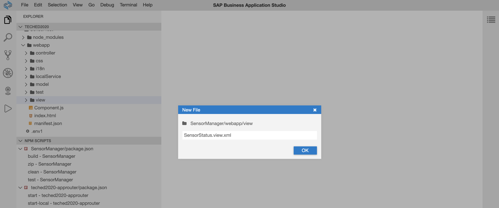
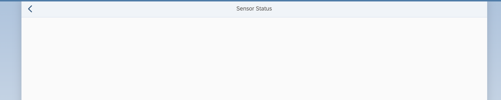
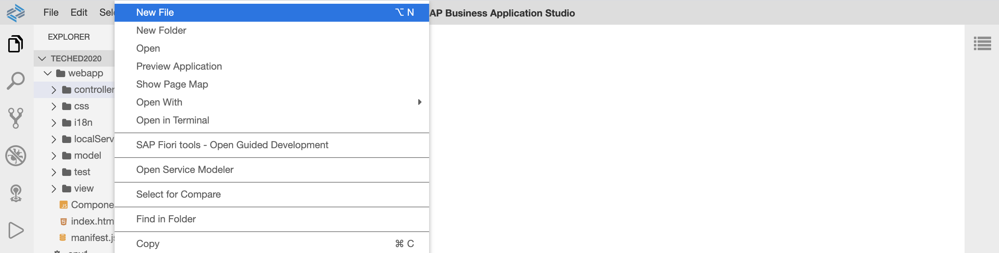
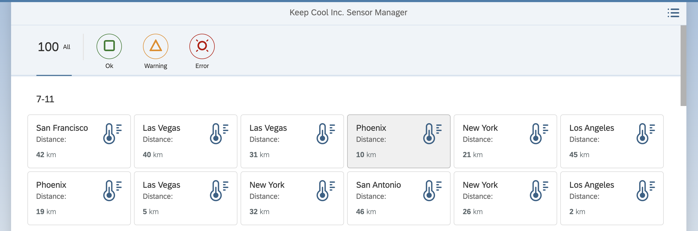
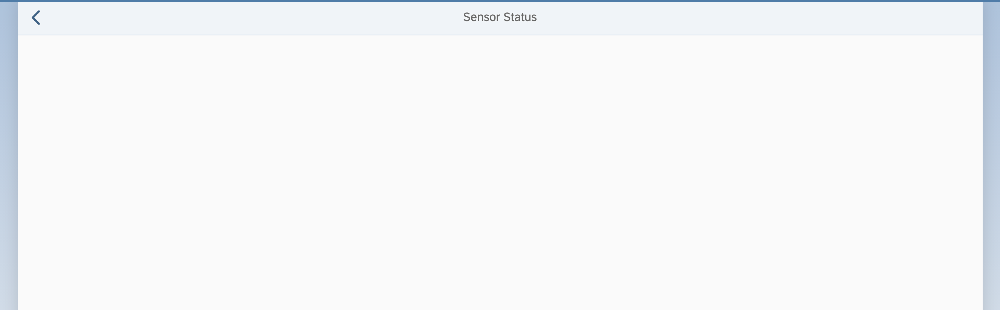
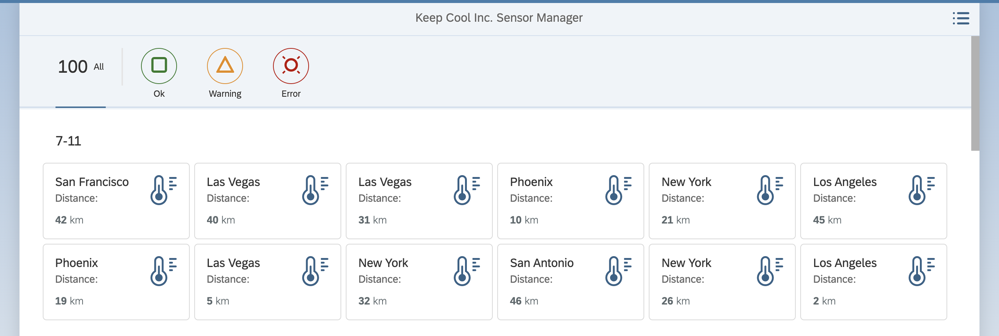

[](https://github.com/SAP-samples/teched2020-DEV164/tree/code/ex8/TechEd2020)
[](https://sap-samples.github.io/teched2020-DEV164/ex8/TechEd2020/SensorManager/webapp/)

# Exercise 8 - Add a Second View with Navigation

Your customer does not only want to have a broad overview of all their icehouses. In case of an error they'd like to inspect a sensor for recent temperature data. You'll add a second view to display more available data.

## Exercise 8.1 - Create SensorStatus.view.xml

Create a new view as follows:

1. Go to folder `SensorManager/webapp/view/`.

2. Right-click on the `view` folder and select `New File`.
<br><br><br><br>

3. Enter `SensorStatus.view.xml` as file name.
<br><br><br><br>

4. Add an empty `sap.m.Page` to the newly created view.

***SensorManager/webapp/view/SensorStatus.view.xml***

````xml
<mvc:View displayBlock="true" xmlns:mvc="sap.ui.core.mvc" xmlns="sap.m">
  <Page id="SensorStatusPage" title="{i18n>titleSensorStatus}" showNavButton="true">
  </Page>
</mvc:View>
````

## Exercise 8.2 - Configure the `manifest.json` file

After creating the new view, you'll next add routing information for it to the `manifest.json` file.

1. Open `SensorManager/webapp/manifest.json`.

2. Go to section `sap.ui5` / `routing` / `routes`.

3. Add a new entry to the `routes` configuration. Note that the new route contains a patch segment in brackets: `{index}`. This will later pass the currently selected sensor as a parameter in the browser hash.

***SensorManager/webapp/manifest.json***

````json
{
    "name": "RouteSensorStatus",
    "pattern": "sensor/{index}",
    "target": ["TargetSensorStatus"]
}
````

4. Go to section `sap.ui5` / `routing` / `targets`.

5. Add a new entry to the `targets` configuration. Here, you need to pass `SensorStatus` as the `viewName`.

***SensorManager/webapp/manifest.json***

````json
"TargetSensorStatus": {
    "viewId": "sensorStatus",
    "viewName": "SensorStatus",
    "viewLevel": 2
}
````

6. Let's see if the newly created view can be opened. Switch to the browser tab with the opened application preview. Add `#sensor/0` at the end of the browser hash and reload the page. The UI5 application is refreshed, and the newly created page is displayed.
<br><br><br><br>

## Exercise 8.3 - Implement the Navigation to the New View

Fine. You can access the newly created view. Next, you need to implement logic to navigate from your first view to the newly created one.

1. Open `SensorManager/webapp/controller/Sensors.controller.js`.

2. Create the function `navToSensorStatus`. Here, you get the index of the currently selected sensor and navigate to the new view by passing the index.

***SensorManager/webapp/controller/Sensors.controller.js***

````js
navToSensorStatus: function(oEvent) {
    var iSensorIndex = oEvent.getSource().getBindingContext("sensorModel").getProperty("index");
    this.getOwnerComponent().getRouter().navTo("RouteSensorStatus", {index: iSensorIndex});
}
````

## Exercise 8.4 - Assign the Navigation Logic to the Sensor Items

After implementing the navigation logic you'll need to assign it to a control, so it can be triggered by the user.

1. Open `SensorManager/webapp/view/Sensors.view.xml`.

2. Add the `press` event to the `sap.m.CustomListItem` control and assign the newly created function.

***SensorManager/webapp/view/Sensors.view.xml***

````xml
<CustomListItem type="Active" press=".navToSensorStatus">
````

3. Let's see if the navigation logic works. Switch to the browser tab with the opened application preview. In the URL, remove any content after `index.html`. Reload the page. Click any sensor. The navigation takes place, and you see the newly created view.
<br><br><br><br>

## Exercise 8.5 - Create SensorStatus.controller.js
Nice. Now let's implement the navigation back to `Sensors.view.xml`. To do this, you'll need a new controller for the newly created view.

1. Go to folder `SensorManager/webapp/controller/`.

2. Right-click on the `controller` folder and select `New File`.
<br><br><br><br>

3. Enter `SensorStatus.controller.js` as file name.
<br><br><br><br>

4. Copy and paste the controller definition given below into the newly created `SensorStatus.controller.js`.

***SensorManager/webapp/controller/SensorStatus.controller.js***

````js
sap.ui.define([
    "sap/ui/core/mvc/Controller"
], function (Controller) {
    "use strict";

    return Controller.extend("keepcool.SensorManager.controller.SensorStatus", {

    });
});
````

5. Open `SensorManager/webapp/view/SensorStatus.view.xml`.

6. Using the `controllerName` attribute, assign the newly created controller to the view.

````xml
<mvc:View controllerName="keepcool.SensorManager.controller.SensorStatus" displayBlock="true" 
  xmlns:mvc="sap.ui.core.mvc" xmlns="sap.m">
````

## Exercise 8.6 - Implement the Back-Navigation to Sensors.view.xml

Next you need to implement the navigation logic.

1. Open `SensorManager/webapp/controller/SensorStatus.controller.js`.

2. Add a `navToSensors` function, which uses the `navTo` method to navigate the `RouteSensors` route, which points to the `Sensors.view.xml` view.

***SensorManager/webapp/controller/SensorStatus.controller.js***

````js
return Controller.extend("keepcool.SensorManager.controller.SensorStatus", {
    navToSensors: function () {
        this.getOwnerComponent().getRouter().navTo("RouteSensors");
    }
});
````

3. Open `SensorManager/webapp/view/SensorStatus.view.xml`.

4. Add the `navButtonPress` event to the `sap.m.Page` control and assign the newly created `navToSensors` function to it.

***SensorManager/webapp/view/SensorStatus.view.xml***

````xml
<Page id="SensorStatusPage" title="{i18n>title}" showNavButton="true" navButtonPress=".navToSensors">
</Page>
````

5. Let's see if the navigation logic works. Switch to the browser tab with the opened application preview. In the URL, remove any content after `index.html`. Reload the page. 
<br><br><br><br>

6. Click any sensor. The navigation takes place, and you see the newly created view.
<br><br><br><br>

7. Click the "<" button to navigate back to the sensor list.
<br><br><br><br>

## Summary

Congratulations, you completed [Exercise 8 - Second View with Navigation](#exercise-8---second-view-with-navigation)!

Continue to [Exercise 9 - Card with NumericHeader](../ex9/README.md).


## Further Information

* Routing in UI5: https://ui5.sap.com/#/topic/902313063d6f45aeaa3388cc4c13c34e)
